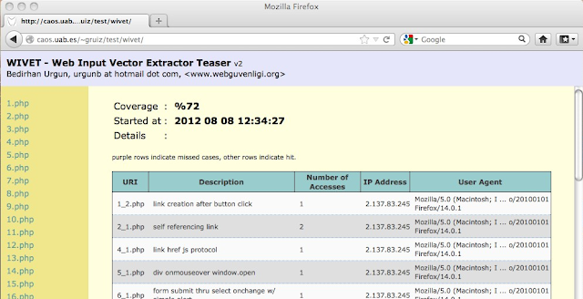
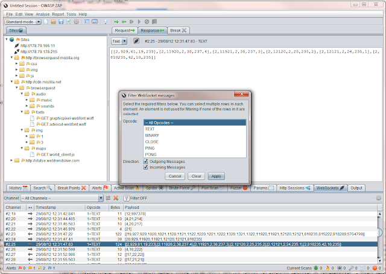

We are getting close to releasing the next major version of ZAP.  
  
As there are so many changes we've decided to go to version 2.0.0 rather than 1.5, and some of the biggest changes have come about thanks to the
[Google Summer of Code](https://www.google-melange.com/archive/gsoc/2012) (GSoC).  
  
This is the first year in which ZAP has taken part in the GSoC, and it has been a resounding success.  
  
In this post I'll give you an overview of the 3 GSoC projects, and an easy way to try them out if you can't wait for the full release.  
  

##  New Spider (plus session awareness)

The current ZAP spider is showing its age.  
It was inherited from the original Paros code, and is not as fast or effective as we would like.  
Cosmin Stefan completely rewrote the spider, which is now much faster and more comprehensive than the old one.  
  
This on its own would have been a great addition to ZAP.  
But Cosmin also added session awareness to ZAP, so that ZAP can keep track of multiple sessions.  
This extension allows you to switch between sessions on the fly as follows:  

  1. Login to the target application
  2. Check to make sure the session is recognised in the Http Sessions tab
  3. Click the "New Session" button
  4. Select another page in your application - your browser should be logged out now
  5. Login to the target application as another user
  6. Both sessions will be active, so you can switch between then using ZAP without having to do anything in your browser

  
  
Note that  the session awareness applies to all of the other ZAP tools, like the spider and active scanner, so you can easily run these tools in
different sessions.  
  

##  Ajax Spider using Crawljax

As mentioned above, the old spider wasn't really effective enough, so we've actually replaced it with 2 spiders!  
  
Cosmin implemented a traditional spider, which analyses the HTML code for any links it can find. This is fast as works well with 'traditional'
web applications. However it's not so effective with Ajax applications which use a lot of JavaScript, so Guifre Ruiz has added an Ajax spider.  
  
Software reuse is one of the core principles we try to follow when developing ZAP, so for this development Guifre made use of the
[Crawljax](https://github.com/crawljax/crawljax) project.  
  
In this spider:  

  * Guifre's code drives Crawljax
  * which uses [Selenium](https://selenium.dev/)
  * to drive a browser
  * which proxies via ZAP 

The Ajax spider follows all of the links it can find via the browser, and so can discover any links an application generates, even ones
generated client side via JavaScript.  
  
This is a great compliment to Cosmin's spider, and means that ZAP will be able to effectively spider a very wide range of applications.  
  
The current version of ZAP only managed to discover 10% of the links in the [wivet](https://github.com/bedirhan/wivet) test application. As you can
see the next Ajax spider is much more effective:  
  
  

##  WebSockets support

The first 2 projects were [OWASP](https://www.google-melange.com/archive/gsoc/2012/orgs/owasp) GSoC projects, but we also had a third [GSoC project](https://www.google-melange.com/archive/gsoc/2012/orgs/mozilla) thanks to
[Mozilla](https://www.mozilla.org/).  
  
Robert Koch enhanced ZAP to support WebSockets, so ZAP can now see all WebSocket messages sent to and from your browser.  
  
And as with HTTP based messages, ZAP can also intercept WebSocket messages and allow you to change them on the fly.  
  
Not only that, but he also integrated the ZAP fuzzer, so you can fuzz WebSockets messages as well using all of the fuzzing payloads included in
ZAP from projects like JBroFuzz and FuzzDB. And of course you can easily add your own fuzzing files.  
  
  
  
As far as I'm aware, this means that currently ZAP has better WebSockets support than any other security tool out there. So if you are
performing a pentest on a app that uses WebSockets then you really need to use ZAP.  

##  Try them now

These three projects are great additions to ZAP, and will form a very significant part of the new 2.0.0 release.  
  
I've been very impressed by the quality of the work all three students produced, and they all required much less supervision than I or the other
mentors expected.  
  
I'd like to thank them again for all of their hard work, and am delighted that they are carrying on contributing to ZAP. I'd also like to thank
to mentors who managed them, the other ZAP developers who supported them, and Google for organising such a great initiative.  
  
And if you want to try out these projects, then you can do so right now :)  
  
Guifre's Ajax Spider and Robert's WebSocket add-on can be downloaded and added to ZAP via the [ZAP Marketplace](/addons/).
(Cosmin's spider is part of ZAP core.)  
  
And all 3 projects are included in the latest [weekly release](/download/#weekly) - so please try this out and let us know what you think!

