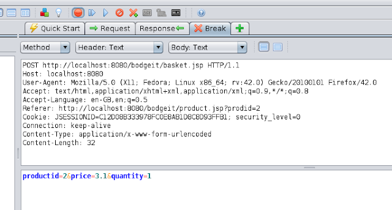
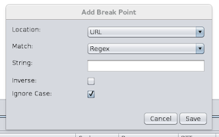

##  Introduction

Welcome to the second ZAP Newsletter.  
And apologies for the delay - 2.4.3 took longer than expected, and last week I was away at a Mozilla work week.  
  
##  News

The big news is that ZAP 2.4.3 is now available to [download](https://github.com/zaproxy/zaproxy/wiki/Downloads)  
This is a development and bugfix release, for more details of all of the changes see the [release notes](/docs/desktop/releases/2.4.3/).  
  
In other news, you can now buy ZAP stickers on [StickerMule](https://www.stickermule.com/uk/user/1070684077/stickers)  
We don't make any money from these stickers - they are just for promoting ZAP:)  
If you’re a ZAP contributor then you can get one for free (just ping me first) and if you’re getting a load for a ZAP talk or training session
then get in touch as well - we’ll do our best to help cover the costs.  
  
And please vote for ZAP in the [Toolswatch Top Security Tools of 2015](https://www.toolswatch.org/2015/11/vote-for-2015-best-security-tool/)!  
  

##  New / Improved Add-ons

_This section details add-ons that have been added or significantly updated since the last newsletter._  
Add-ons are available to download and install within ZAP.  
Just click on the ‘Manage Add-ons’ toolbar button and select the Marketplace tab:  
  
  
  
Note that all add-ons on the Marketplace are completely free and open source and anyone can publish add-ons to it - see the [zap-extensions wiki](https://github.com/zaproxy/zap-extensions/wiki/AddOnDevelopment) for details.  
  
Many add-ons have been updated in ZAP 2.4.3, but in most cases these have been for relatively minor enhancements and bug fixes.  
The add-ons that have had significant changes include:  
  

### Fuzzer

This includes lots of changes, including:  

  * Add HTTP processor for tagging fuzz results. 
  * Show the number of payloads from the script in Fuzzer dialogue ([1887](https://github.com/zaproxy/zaproxy/issues/1887)).
  * Improve memory usage ([2051](https://github.com/zaproxy/zaproxy/issues/2051)).
  * Allow to preview payloads generated or from external sources ([1896](https://github.com/zaproxy/zaproxy/issues/1896))
  * Allow to modify the selected Payload Processor script.
  * Show current payloads when adding/modifying processors ([1898](https://github.com/zaproxy/zaproxy/issues/1898)).
  * Allow to preview processing of payloads ([1931](https://github.com/zaproxy/zaproxy/issues/1931)).
  * Allow to save (to file) String, Regex, File and Script payloads ([1932](https://github.com/zaproxy/zaproxy/issues/1932)).
  * Add support for regex repetitions ([1885](https://github.com/zaproxy/zaproxy/issues/1885)).
  * Allow to modify the payloads of File and File Fuzzers ([1897](https://github.com/zaproxy/zaproxy/issues/1897)).

### Active scan rules - release

  * Promoted Format String to release

### Active scan rules - beta

  * Demoted LDAP rule to alpha due to performance issues

### Active scan rules - alpha

  * Added Integer Overflow scanner
  * Added User Agent Fuzzer

### Passive scanner rules - alpha

  * Image Location Scanner detects more GPS tag varieties, scans png & tiff files, adds i18n.

##  New Features

The Docker [weekly](https://hub.docker.com/r/owasp/zap2docker-weekly/) and [stable](https://hub.docker.com/r/owasp/zap2docker-stable/)
containers now support virtual displays.  
The zap.sh script works as before, but a new zap-x.sh script has been added which starts xvfb (X virtual framebuffer) in the background and
means that you can use Selenium based add-ons like the Ajax Spider and DOM XSS scanner with ZAP in daemon mode.  

##  Tutorial: Break Points

_This section will teach you more about a different ZAP feature every month, starting with the Check for Updates functionality._  
ZAP in an intercepting proxy, which means that you can intercept and change anything that is proxied through ZAP.  
In order to tell ZAP that you want to intercept requests or responses you need to use break points.  
Break points are controlled using the following buttons on the main toolbar:  
 /  Break on all requests and responses - the icon turns red when active  
 Submit and step to the next request or response  
 Submit and continue to the next break point  
 Bin the request or response  
 Add a custom HTTP break point  
  
The easiest option is the ‘global’ break point which you can set using the ‘break’ button (the green ball). Initially it will be green -
pressing it will change the colour to red and means that all requests and responses will now be intercepted. You can change the toolbar to show
2 break buttons - one for requests and one for responses - this was the only option in older versions of ZAP:  
 /  Break on all requests - the icon turns red when active  
 /  Break on all responses - the icon turns red when active  
All break point options are configured via the [Options/Breakpoints screen](/docs/desktop/ui/dialogs/options/breakpoints/).  
  
Once a break point is hit the request or response that was intercepted is displayed in the ‘Break’ tab:  
  
You can change anything you like in the Break tab, you can even change binary data using the Hex views.  
The intercepted message will stay in the Break tab until you press either the ‘Submit and step’ button (which will submit the message and
intercept the next request or response), the ‘Submit and continue’ button (which will submit the message and unset the global break point) or
the ‘Bin’ button which will drop the message.  
  
By default the global break point affects all messages - you can change it to just apply to messages that are [in
scope](/docs/desktop/start/features/scope/) via the options.  
  
You may find that some applications continually make requests, making it difficult to find and intercept the one you are interested in.  
If you encounter this situation then you can use custom break points.  
There is a button on the main toolbar for custom HTTP break points, this launches the custom HTTP break point dialog:  
  
This dialog allows you to create a custom HTTP break point that will only be hit when specific conditions are met. You can perform exact or
regex matches against the URL, request header, request body, response header or response body.  
You can have as many custom break points as you need - they are listed in the ‘Break Points’ tab from where they can be enabled, disabled,
edited or deleted.  
  
Break points are not restricted to HTTP(S) traffic - they are also supported for [websockets](/docs/desktop/addons/websockets/tab/#breakpoints) and [client side messages](/docs/desktop/addons/plug-n-hack/clientstab/). Both of these also support custom break points via buttons on the tool bars for the respective tabs.  
  
If custom break points still don’t provide you with enough flexibility then you can trigger break points from within proxy scripts.  
Calling msg.setForceIntercept(true) in either of the proxyRequest(msg) or proxyResponse(msg) functions will trigger the break point, and this
will work in any text based scripting language. [Zest](/docs/desktop/addons/zest/) (which is graphically
based) also includes a ‘break’ action statement that has the same effect.  
Being able to trigger break points via scripts means that you can trigger them for exactly the conditions you are interested in, however complex
they might be.  
  

##  3rd Party Tool: ThreadFix

_Each month we plan to cover a 3rd party tool that is related to ZAP in some way. These tools can be open source, closed source, free or
commercial._  
This month we’re covering ThreadFix, ℅ Dan Cornell ([@danielcornell](https://twitter.com/danielcornell))  

ThreadFix is an application vulnerability management platform that allows organizations to create a consolidated view of their applications and
vulnerabilities, prioritize application risk decisions based on data, and then translate vulnerabilities to developers in the tools they’re
already using.  
  
With ThreadFix and OWASP ZAP, a security analyst can keep track of their application portfolio – laying out the various teams developing
software and the applications each team is developing. Then, for each application, results from application scanning with ZAP can be uploaded
and tracked over time. These results can be de-duplicated and correlated with other static and dynamic scanners, providing a comprehensive view
of the results of security testing. In addition, ThreadFix can bundle vulnerabilities together and create bugs and software change requests in
defect trackers such as JIRA and Bugzilla.  
  
ThreadFix also provides a [plugin](https://github.com/denimgroup/threadfix/wiki/Zap-Plugin) for ZAP allowing security analysts to:

  * Directly export ZAP scan results into ThreadFix, saving time.
  * Pre-seed ZAP scans with application attack surface information when given access to application source code. This allows application testers to increase the coverage of scans by identifying “hidden” landing pages and input parameters that might not be found by a standard application spider/crawl.

In addition to the capabilities of the open source ThreadFix Community edition described above, ThreadFix Enterprise provides security teams the
ability to schedule and execute scans with headless ZAP clients and have those results fed directly to the ThreadFix server. This allows
security analysts to set a baseline level of scheduled scans and allows development teams to self-serve ZAP scans via the ThreadFix API.  
  
More information can be found at:

  * ThreadFix GitHub site: <https://github.com/denimgroup/threadfix>
  * ThreadFix homepage: <http://www.threadfix.org/>

  
  

##  Upcoming Talks and Training

**Aaron Guzman** will be running a training session titled "Web Pentesting Using OWASP Tools" (which will, of course, include ZAP) at AppSec
California in Santa Monica on January 25 9:00am-5:00pm: <http://sched.co/4Ouf>  
  

##  Featured Contributor: Yuho Kameda

_And each month we plan to introduce you to one of the many ZAP contributors._  
**My profile**  

  * Name: [亀田 勇歩](https://www.owasp.org/index.php/User:Yuho_Kameda) (aka ykame) [@yuhokameda](https://twitter.com/yuhokameda/)
  * Based: Japan


  
**About my activities (job)**  
I am a security engineer in Japan.  
  
My works are following.

  * Vulnerability assessment
  * Incident Response
  * Various analysts

I was web application developer. I make use of my past experience to spread ZAP in Japan.  
  
**About my activities (private)**  
Capture the Flag:

  * I am participating in the security competition called Capture the Flag (CTF) as the Japanese team. I has participated domestic and foreign countries competition(such as DEFCON).

To participate various working group:

  * Mainly in Japan, I participate various working group in [OWASP Japan Local Chapter](https://www.owasp.org/index.php/Japan).
  * For example, I made skill mapping of vulnerable assessment, and requirement definition document of web application or system.

  
  
**About activity of ZAP**  
Mainly, I am working activity of ZAP about the three points.

  * How to use ZAP and find vulnerable of web application.
  * good publicity of ZAP.
  * presentation and hands-on session of ZAP in Japan.


  
**My contribute to ZAP (until)**  
My activity mainly spread ZAP knowledge in Japan. There is [OWASP Japan Local Chapter](https://www.owasp.org/index.php/Japan) in Japan.  
Mainly, I introduce ZAP in OWASP Japan. In other, I made [Japanese ZAP
Manual](https://docs.google.com/file/d/0B1e1Cma1GUllazNUNVp6OWdGYzg/edit). OWASP Japan released this manual on web site.  
I recognized to be used ZAP on many users in Japan. I am so happy to be able to contribute.  

  
**My contribute to ZAP (from now on)**  
I continue to spread activity. And then, I will go ahead with translate of ZAP. I want everybody to know that ZAP is easy to use. I'd like to
contribute to ZAP project.  
  
**Finally**  
I like ZAP project. I'd like to contribute with other contributor in ZAP project.  
And then, I hope that many user will use ZAP.  
Thank you for your time reading.  
  
**最後に**  
ZAP Evangelistとして活動している[亀田 勇歩](https://www.owasp.org/index.php/User:Yuho_Kameda)です。  
ここまで英語の記事に目を通して頂きありがとうございます。  
  
セキュアなWebアプリケーション/システムを構築できるように、  
今後もZAPに関する様々な情報を日本でお届けしていきます。  
みなさんのZAPコミュニティへの参加をお待ちしております。  
  

##  Feedback

So … did you find that useful?  
Please fill in this quick [Feedback Form](https://docs.google.com/forms/d/1_XaettHPjLOD56AbSlui67gk-771yJ_xfd7w2lSEdXw/viewform?usp=send_form)
so that we can make sure this newsletter is as useful to you as possible.  
  

##  Coming next month…

That depends on you!  
Let us know what you would like to see using the above feedback form.  
If you would like to write content for the newsletter then please get in touch - anything ZAP related, such as talks / training you are giving,
a 3rd party tool you develop or maybe an add-on you’d like to explain in more detail.  
And we’re also looking for one or more editors for the ZAP newsletter - you don't need any detailed ZAP knowledge, just a bit of time each month
you can dedicate to chasing up people for content and bashing it into something that reads better than this one :P Think thats you? Get in
touch!  
  
Simon Bennetts (ZAP Project Lead)  

