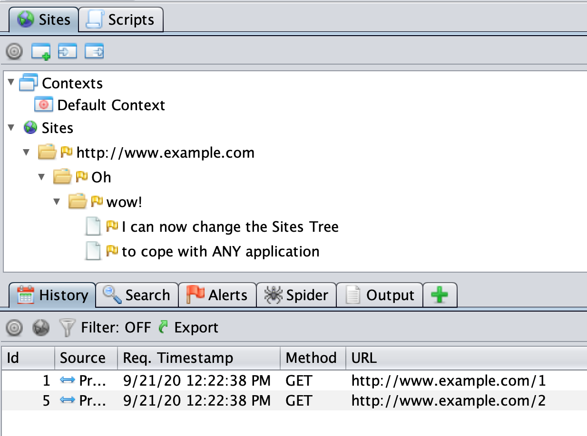
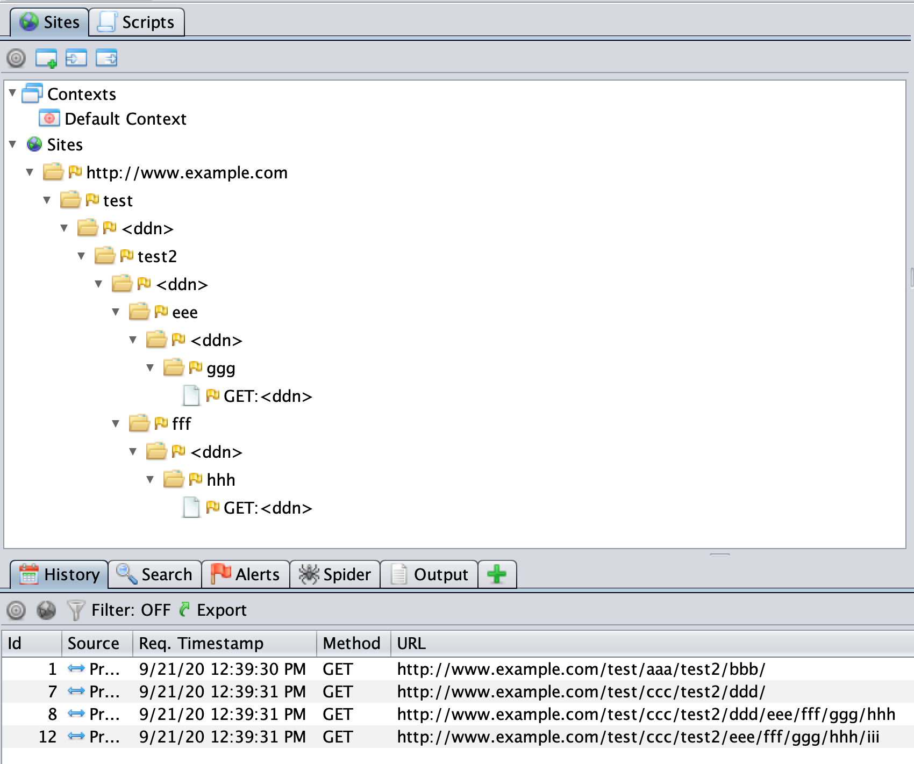

## The Sites Tree

The Sites Tree is a key component of ZAP, and one whose purpose is often misunderstood.

This blog post will explain why the Sites Tree is so important, how you can change it now and how you will be able to change it in the next ZAP release.

## Why do we have the Sites Tree?

In ZAP we separate exploring an app from attacking it. This gives us much more flexibility to handle different scenarios.

So let's take the case where we are proxying unit tests through ZAP.

Unit tests are there to test functionality not to minimise HTTP(S) calls, so it is likely that the same URL will be called many times, potentially hundreds or thousands of times. 

One of the big drawbacks of Dynamic Application Security Testing (DAST) is the length of time it takes. The number of requests a scanner makes directly impacts the time taken, so it's important to try to minimise the number of requests while maximising their effectiveness. As always it's a balancing act.

If we only had the History table available then we would end up attacking that URL as many times as it occurs. There are currently 18 release quality active scan rules and at medium strength each of those can make around 12 requests per parameter per page. So if you have 3 parameters on that repeated URL then we will attack the same URL 18 x 12 x 3 = 648 times each time we come across it in the History table. That would make the scan way longer than it needs to be.

## What does the Sites Tree Represent?

The Sites Tree essentially removes the duplicates from the History table, but also does much more.
It is ZAP's internal representation of the app and if it does not accurately reflect the app then ZAP will not be able to attack it effectively.
Each node in the tree represents a different piece of functionality in the app.
By default ZAP will create unique nodes in the tree based on the HTTP method and the parameter names.

This means that the following requests will all end up having different tree nodes:

* `GET https://www.example.com?a=b&c=d`
* `GET https://www.example.com?a=b&d=c`
* `POST https://www.example.com?a=b&c=d`

And these requests will end up having the same node:

* `GET https://www.example.com?a=b&c=d`
* `GET https://www.example.com?a=c&c=c`
* `GET https://www.example.com?a=e&c=f`

This works pretty well in lots of cases - different HTTP methods and parameter names typically mean different actions while the parameter values usually don’t change the outcome.

## Exceptions to the Rule

There are always exceptions.

Take the case where the action to be taken is actually defined in a parameter value:

* `GET https://www.example.com?a=b&action=add`
* `GET https://www.example.com?a=b&action=delete`

In this case both URLs will end up in the same Sites Tree node, which means that in practice only one of them will be attacked. The other URL will not be attacked and so any vulnerabilities specific to that action will not be found.

In ZAP the solution to this is to define the ‘action’ parameter as a [Structural Parameter](/docs/desktop/start/features/structparams/), in other words a parameter whose value actually affects the structure of an app. Once you have done that (and revisited the URLs) then they will appear as 2 different nodes and ZAP will attack them separately.

Conversely we have the case where a URL path element is actually part of the data and not part of the structure of the app.
For example the following URLs could all represent the same functionality if the second path element (`companyX`) is actually data:

* `https://www.example.com/app/company1/aaa?ddd=eee` 
* `https://www.example.com/app/company2/aaa?ddd=fff` 
* `https://www.example.com/app/company3/aaa?ddd=ggg`

In this case all 3 URLs will end up in unique nodes and ZAP will attack each of them even though it doesn't really need to. This probably is not a big problem if there are just 3 instances, but in most cases this data will be coming from a database so there could be a huge number of such nodes.

The solution to this is to define the relevant path element as [Data Driven Content](/docs/desktop/start/features/ddc/) which means path elements that really contain data rather than represent part of the app structure. Once you have done that (and revisited the URLs) then they will all be represented as just 1 node and ZAP will only attack them once.

You will need to define both Structural Parameters and Data Driven Nodes manually - ZAP does not currently have the capability to automatically detect these situations.

## Custom Data Formats

We have yet another problem, and one that ZAP 2.9.0 cannot effectively solve.

The above techniques only work if ZAP understands the structure of the data.
While we do our best to make sure that ZAP can always understand the structure of the most common data formats there will always be custom formats that we never get to hear about or new formats that are introduced after a ZAP release.

ZAP 2.9.0 does allow you to attack these custom formats as it provides [Input Vector Scripts](https://github.com/zaproxy/community-scripts/tree/master/variant) which allow anyone to write ZAP scripts to handle these formats. However these scripts cannot change how URLs are represented in the Sites Tree which means that we end up with the same problems as before.

# The Solution

This will be solved in the next version of ZAP (2.10.0) which extends the definition of Input Vector Scripts to allow them to change the way URLs are represented in the Sites Tree. This means that anyone can write a script which will allow their app to be correctly represented in the Sites Tree and therefore be attacked effectively.

The changes have already been made and are available in the latest weekly release for you to try out now.

An example script will be included in ZAP: [Site modifying JSON example.js](https://github.com/zaproxy/zaproxy/blob/develop/zap/src/main/dist/scripts/templates/variant/Site%20modifying%20JSON%20example.js)

Note that if you try this script out with the ZAP weekly Desktop then you will need to disable the HUD to prevent it from trying to upgrade HTTP connections to HTTPS ones!

This script will work with requests like:

* `GET http://www.example.com/page/?%5B%7B%22key%22:%22aa%22,%22value%22:%22bb%22%7D%5D`
* `GET http://www.example.com/page/?%5B%7B%22key%22:%22aa%22,%22value%22:%22bb%22%7D,%7B%22key%22:%22cc%22,%22value%22:%22dd%22%7D%5D`
* `POST http://www.example.com/page/`
  * `[{"key":"aa","value":"ee"},{"key":"cc","value":"ff"}]`

It will ensure that the JSON parameter values are identified and can be attacked and will change the node names in the Sites Tree to be:

The script will also work with requests like:

* `GET http://www.example.com/test/aaa/test2/bbb/`
* `GET http://www.example.com/test/ccc/test2/ddd/`
* `GET http://www.example.com/test/ccc/test2/ddd/eee/fff/ggg/hhh`
* `GET http://www.example.com/test/ccc/test2/eee/fff/ggg/hhh/iii`

In this case it will change the Site Tree node paths to be:

Input Vector scripts can change Site Tree node names and/or node paths, which gives complete control over how URLs are represented in the Sites Tree.

In addition to this in 2.10.0 the underlying [Variant.java](https://github.com/zaproxy/zaproxy/blob/develop/zap/src/main/java/org/parosproxy/paros/core/scanner/Variant.java) class will become plugable, meaning that ZAP add-ons will be able to dynamically add (and remove) classes which can identify input vectors to attack and change how URLs are represented in the Sites Tree.

These 2 changes will allow ZAP to handle any custom data formats and ensure that ZAP can then effectively attack the applications that use them.

This functionality will be showcased by the [GraphQL add-on](/blog/2020-08-28-introducing-the-graphql-add-on-for-zap/) implemented as part of this year's Google Summer of Code and which is still being enhanced.
