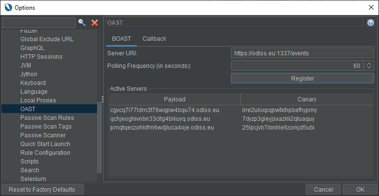

The OAST add-on for ZAP enables it to communicate with services like [BOAST](https://github.com/marcoagner/boast), [TukTuk](https://github.com/ArturSS7/TukTuk), and [interactsh](https://github.com/projectdiscovery/interactsh) (given that they are supported by the add-on), thereby providing functionality similar to [PortSwigger's Burp Collaborator](https://portswigger.net/burp/documentation/collaborator). The add-on is available for download right now from the ZAP marketplace.

This blog post is going to go over the features of the OAST add-on and demonstrate how you can leverage ZAP's scripting features to write scripts that exploit out-of-band vulnerabilities. It assumes you already have the add-on installed.

The OAST add-on currently supports two services: BOAST and Callbacks. Callbacks have been a part of the ZAP core since 2017. However, the Callback service has been made available as part of the OAST add-on now and will be deprecated in the core soon. 

The blog post titled ["ZAP SSRF Setup"](/blog/2020-03-09-zap-ssrf-setup/) is a good explainer on how ZAP Callbacks can be configured to perform out-of-band attacks like SSRF. This post will focus on working with BOAST.

## Registering a BOAST Server
### From the GUI
1. Go to the Options window in ZAP. To do so you could either
    - go to `Tools` &rarr; `Options...`, 
    - click on the gear icon  in the toolbar, or 
    - press `ctrl` + `alt` + `O` .
1. Choose OAST from the list under *Options*.
1. Select the BOAST tab in the OAST Options screen.

    

1. Enter a valid server URI. This address should point to the URI that will be used for registrations and polling.

    A valid URI will include the scheme, the host, the port, and the `/events` endpoint. The host must be running a working instance of BOAST.

    An example of a valid URI is: `https://example.com:1337/events`.
1.  Choose a polling frequency. This is the rate at which the registered BOAST servers will be polled. It takes values in seconds. The minimum allowed value is 10 seconds and there is no maximum allowed value. The default value is 60 seconds.
1. Click on Register. 
1. You will notice that a new entry has been added to *Active Servers* table. You can copy the payload with `ctrl` + `C` to use it in your attacks.

    ZAP will now poll this server at the frequency you set and report all interactions (DNS, HTTP) with the payload URI in the OAST tab in the main screen.

    

### From a script
The following code snippet registers a new BOAST server:
```js
var Control = Java.type("org.parosproxy.paros.control.Control")
var extOast = Control.getSingleton().getExtensionLoader().getExtension("ExtensionOast")
var boast = extOast.getBoastService()
var server = boast.register("https://odiss.eu:1337/events")
```

And this is how you can get the details of the registered server:
```js
print("Server URI: ", server.getUri())
print("ID: ", server.getId())
print("Payload: ", server.getPayload())
print("Canary: ", server.getCanary())
```

To poll all registered servers:
```js
boast.poll()
```

To change the automatic polling frequency (in seconds):
```js
boast.getParam().setPollingFrequency(30)
```

You can get an array of all the registered servers with:
```js
var registeredServers = boast.getRegisteredServers()
registeredServer.forEach(s => print(s.getPayload()))
```

This information should allow you to write scripts that can register a BOAST server, get its payload and use that in attacks. However, one crucial step is being able to perform an action when ZAP actually discovers an out-of-band message received by BOAST. For that, we can register a request handler as illustrated in the following section.

## Registering a Request Handler
You can register a request handler from a script or a scan rule.
```js
function requestHandler(request) {
    print("Source: ", request.getSource())
    print("Referer: ", request.getReferer())
    print("Handler: ", request.getHandler())
    print()
}

boast.addOastRequestHandler(requestHandler)
```

The method `addOastRequestHandler(...)` accepts an [OastRequestHandler](https://github.com/zaproxy/zap-extensions/blob/5e5f01d822e3a563336589f339adfedb647d0235/addOns/oast/src/main/java/org/zaproxy/addon/oast/OastRequestHandler.java) as a parameter and it should work with all [OastServices](https://github.com/zaproxy/zap-extensions/blob/5e5f01d822e3a563336589f339adfedb647d0235/addOns/oast/src/main/java/org/zaproxy/addon/oast/OastService.java).

You can make the request handler do whatever you want. Here are some use cases:
- Notify a webhook (e.g. send a message to Slack or Discord, raise an issue on a bug tracker, tweet something, etc.)
- Invoke another script (e.g. order yourself a pizza with selenium 😃)
- Raise an alert (e.g. if a payload URI is accessed)

One thing that should be noted is that adding a request handler is not an idempotent operation. That is, if you add the same request handler multiple times then the action will also be performed multiple times.

## What's next for OAST?
- Scan rules! Update existing active scan rules like XXE, ExternalRedirect, RemoteFileInclude, ServerSideInclude, etc. and make them use out-of-band payloads. Introduce new scan rules like OutOfBandXSS, SuperBlindSQLInjection, BlindSSRF, etc.
- Support the API and the Automation Framework.
- Support long-term polling across ZAP instances.
- Support other OAST services based on community feedback.

Keep an eye out for updates! Visit the [Community page](https://www.zaproxy.org/community/) to learn how you can get in touch. Check out the [project blog](https://ricekot.com/projects/zap-oast/) for blog posts related to the development of OAST.

I developed this add-on as a participant of Google Summer of Code 2021. I am deeply grateful to the program organizers and my mentors.

## List of OAST PRs

This is a list of all pull requests (excluding those related to releases) that were created for the OAST add-on.

|Pull Request|Description|
|---|---|
|[#2996](https://github.com/zaproxy/zap-extensions/pull/2996)|Create a bare-bones add-on.|
|[#6675](https://github.com/zaproxy/zaproxy/pull/6675)|Add a new type for persisting OOB messages.|
|[#3033](https://github.com/zaproxy/zap-extensions/pull/3033)|The first functional version of the add-on.|
|[#3053](https://github.com/zaproxy/zap-extensions/pull/3053)|Fix two major issues with the add-on: requests were not showing up in the OAST tab & BOAST servers were not being polled after registration.|
|[#3067](https://github.com/zaproxy/zap-extensions/pull/3067)|BOAST: Add an option to allow changing the polling frequency & show all registered servers in the Options screen.|
|[#3077](https://github.com/zaproxy/zap-extensions/pull/3077)|Add a BOAST standalone script and an OAST standalone script template.|
|[#3082](https://github.com/zaproxy/zap-extensions/pull/3082)|Fix an issue where script templates were being loaded twice.|
|[#6760](https://github.com/zaproxy/zaproxy/pull/6760)|Bundle the add-on with weekly releases.|
|[#3084](https://github.com/zaproxy/zap-extensions/pull/3084)|Minor GUI and help updates.|
