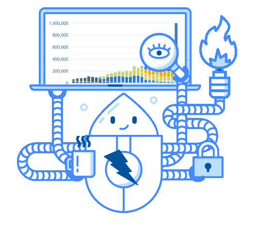

We are planning to add telemetry to ZAP - data that will tell us more about how ZAP is being used.
This blog post explains why we are planning on doing this, what data we plan to collect, what data we will definitely not collect, 
the benefits you can expect, and how you will be able to opt out of it.

### Why Collect More Data

We currently have very little idea of how people use ZAP.
The information currently available to us is detailed in the blog post [Collecting Statistics For Open Source Projects](/blog/2021-04-19-collecting-statistics-for-open-source-projects/).

This gives us a very rough idea of the number of times ZAP is downloaded and used but nothing else.
ZAP is maintained by a relatively small core team and therefore have to be very careful what we focus on.

### What Data Are We Planning To Collect?

We want to know information which will help us focus on making ZAP better.

This is likely to include:
* Information about the environment in which ZAP is running:
  * Operating System
  * Java Version
  * Amount of memory available
  * If it is running in a container like Docker
* The ZAP features being used, such as:
  * Traditional Spider
  * Ajax Spider
  * Active scanner etc
* The optional add-ons which have been installed
* The ZAP active and passive rules being used
* The numbers of vulnerabilities each types of rule reports
* The numbers of issues flagged as false positives

We will also get the IP addresses of ZAP instances which upload the telemetry but our plan is to __not__ record the least significant part of the IP address - this will allow us to determine the probable country of origin without storing the full address.

### What Data Will We Never Collect?
We will never collect details of the sites ZAP is being used on, details of the vulnerabilities or any personal identifiable information (PII). 

We do not want this information and do not want to be responsible for storing or protecting it!

ZAP will continue to be GDPR compliant as we will not be collecting PII.

### What Benefits Can You Expect?

In much the same way that we use the survey results to help focus the activities of ZAPs roadmap, the information we plan to collect will give us a much better understanding of how people are using ZAP. This will mean that we can focus on the features that people use the most.

The information regarding the scan rules will allow us to understand which rules people are using and which ones are less effective. We can then focus on improving any rules that are causing problems.

We plan to publish any information that we think could be helpful. This will help you understand which scan rules and add-ons are the most popular, which rules take more time to run and which are the most effective.

### How To Opt Out

The telemetry option will be enabled by default.

We know that most people do not change the defaults so if it was “opt-in” then we would not collect enough representative information.
However we will make it very easy to out-out of telemetry.
There will be a command line option which will disable it when ZAP starts up and a desktop options panel which will allow you to opt in or out and see exactly what data ZAP has sent to us.

The telemetry feature will of course also obey the `-silent` [command line option](/docs/desktop/cmdline/).

If you have any thoughts or concerns about any of this then please post them to 
[this thread](https://groups.google.com/g/zaproxy-users/c/k_AvtTO6Ch8/m/VIb6nMrCAgAJ) on the ZAP User Group.
