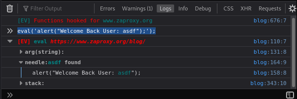
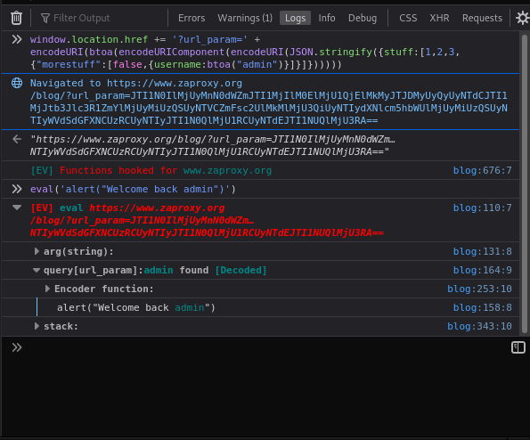

Eval Villain was recently added to the ZAP Marketplace - this add-on installs the 
[Eval Villain web extension](https://addons.mozilla.org/en-GB/firefox/addon/eval-villain/) when you 
[launch Firefox](/blog/2021-11-26-launching-browsers-with-extensions/).

This extension allows the inspection of arguments to arbitrary native JavaScript functions. This tool has similar use cases to DOM Invader in Burp— but Eval Villain has a *lot* more configuration options. As the author of Eval Villain, I was invited to do this guest blog post and explain how to get the most out of the tool.

## Eval Villain Quick Start 

To get started with Eval Villain launch Firefox from ZAP, select the Eval Villain icon on the top right hand side of Firefox, click the enable switch and reload the current web page. Now open the Firefox developer tools and go to the console there you should see a message at the top like "[EV] Functions hooked for <<url>>". This means Eval Villain is loaded and is working for the current URL. If there are DOM interactions you may see more in the page, and if you see other messages in red you may have already found DOM XSS!

More likely that's not the case, so let's fake an interaction just to see what it’s like. For the sake of example, let's put something into `eval` and see if Eval Villain can catch it. You can quickly experiment with Eval Villain by typing into the console.

Imagine the website uses `eval` to pop an alert box and welcome you to the site. Try typing this into the console: `eval('alert("welcome to the website")')`. You’ll see the alert box work, but you’ll also get a notification from Eval Villain. If you expand all the console groups, you should see something like this:


Eval Villain notified you that the hooked function `eval` was used. You can see the argument passed to eval was `alert("Welcome to the website!")`, and a stack trace shows where the function was called. The top two functions in the stack trace are actually a part of Eval Villain—but they are left in to make everything transparent and debuggable.

The above result is not considered *interesting* by Eval Villain because the argument to `eval` did not contain a *needle* or something from a common DOM XSS source. Let's make it *interesting* by including a *needle*. A *needle* is similar to canaries in DOM Invader but with Eval Villain you can watch for multiple *needles* at once. They can also include regular expressions, which can help overcome encoding (e.g. `/needle(<|&gt;|%3c)/gi`). Any time a hooked function receives input containing a *needle*, Eval Villain will mark it *interesting* and highlight it. Eval Villain comes pre-configured with the *needle* "asdf", so you can try out the *needle search* by typing into the console `eval('alert("Welcome Back User: asdf");');`. You should see something like this:



Because Eval Villain considers this result to be *interesting* it highlights the group in red, auto-opens the group and adds the *needle* field. The *needle* field is also auto-opened and contains the argument to `eval` with our needle highlighted. How Eval Villain formats output and what it auto-opens can be quickly modified in the configuration page.

## Interesting Sources and Encodings

Having a *needle* is nice, but it can be tedious to inject *needles* into all DOM XSS sinks. What if a website just puts all its variables into a single base64 encoded JSON string inside a URL parameter? Eval Villain takes care of this case by default—no needle is necessary.

As an example, let's do the same experiment as above but this time the username won’t contain a *needle*. Instead we will make it a nightmare of encoding that lives inside a URL parameter. Let's hide the username "admin" inside of this encoding (we’ll let the console do the work):

```JavaScript
window.location.href += '?url_param=' + encodeURI(btoa(encodeURIComponent(encodeURI(JSON.stringify({stuff:[1,2,3,{"morestuff":[false,{username:btoa("admin")}]}]})))))
```

Now let's pretend the website parsed this new ugly string and welcomed the contained "admin" user with: `eval('alert("Welcome back admin")')`.



Eval Villain figured it out! Although the "admin" string was not a *needle*, Eval VIllain decoded it from the `url_param` query parameter. So when "admin" was seen hitting a hooked function, it considered that call *interesting*. If this was a real test, the next step would be to replace "admin" with our own payload and try to get XSS; which means reproducing the encoding ourselves. Thankfully, Eval Villain can help with this too!

Expand the "Encoder function" console group and you should see something like:

```JavaScript
encoder = (x, y) => {
    x = btoa(x);
    {
        let _ = {"stuff":[1,2,3,{"morestuff":[false,{"username":"YWRtaW4="}]}]};
        _["stuff"][3]["morestuff"][1]["username"]= x;
        x = JSON.stringify(_);
    }
    x = encodeURIComponent(x);
    x = encodeURIComponent(x);
    x = btoa(x);
    let _ = new URL(window.location.href);
    // next line might need some changes
    _.searchParams.set('url_param', decodeURIComponent(x));
    x = {href: _.href, param: x};
    if (y) window.location = x.href;
    return x;
}//
```

This is a guess by Eval Villain as to how the website is encoding the URL parameter. You can see Eval Villain was able to guess the encoding quite well. It wasn’t perfect—it got `encodeURIComponent` and `encodeURI` confused—but it’s likely close enough to pass. Using this function you can quickly encode and prototype XSS payloads, then use Eval Villain output to see how those characters were encoded/filtered.

## DOM XSS Sources

We have seen Eval Villain detect *needles* and URL parameters inside of DOM XSS sinks. It also looks for *interesting* strings in the URL fragment, window name, local storage and document cookie. The last two might seem a bit strange, as they are typically only thought of as being self-XSS. So Eval Villain uses a different coloring theme for those findings, the default being yellow. I decided to include them because these self-XSS vectors are often left unpatched and can function as a reflected XSS upgrade. I like to think of them as XSS batteries.

For example, during one audit I received two notifications from Eval Villain. One turned out to be DOM XSS via the window name of an iframe hosted on the website. The name was heavily encoded but Eval Villain provided the encoder function to quickly dev a proof of concept and verify the finding. The second finding was for a DOM XSS via local storage. Again the provided encoder function allowed me to verify this self-XSS was valid. Of course, Self-XSS by itself is worthless, nor is the iframe XSS very exciting on its own—it runs only once. But by combining them I had a __persistent__ DOM XSS vulnerability that was completely invisible to server logs, IDS and web application firewalls. Never is the local storage entry or window name sent to the server; everything happened in the victim’s browser. So keeping an eye on local storage and document cookies can help you upgrade the severity of an XSS finding — and maybe get you a bigger bounty payout.

Currently Eval Villain does not keep an eye on window postmessage as a source. It's possible to hook this API and monitor it in Eval Villain — just be judicious about enabling normal results, as this will cause some websites to slow to a crawl.

## Inner Workings

Knowing just a bit about how Eval Villain works goes a long way toward understanding its advantages and limitations. Eval Villain is built around the [contentscripts.register](https://developer.mozilla.org/en-US/docs/Mozilla/Add-ons/WebExtensions/API/contentScripts/register) API. 
This Firefox-only API allows Eval Villain to register a content script __with__ the user 
[configuration included](https://github.com/swoops/eval_villain/blob/master/src/js/background.js#L349-L357). 
In essence, Eval Villain is building the user configuration into a JavaScript string and forcing it into a web page before the web page has had a chance to run its own JavaScript. Since there is no race with the web page, Eval Villain will even hook functions before inline JavaScript has a chance to run on a local "file://" scheme.


Since DOM Invader works on Chrome which lacks `contentscripts.register`, the browser must be restarted when a user configuration change is made. With Eval Villain, it's just a matter of refreshing the page. This is also the reason Eval Villain works exclusively on Firefox.

The flexibility afforded by not requiring a restart allows Eval Villain to handle a large set of configuration options without becoming too cumbersome to use. You can see the detailed configuration options by clicking the Eval Villain icon and then clicking "configuration". This is where you can add/delete functions, needles or targets. You can even set arbitrary CSS on the `console` output to theme it any way you like. The options I find myself using the most have been added into the icon menu itself.

Easy config changing means you can adapt quickly to websites. For example, many websites abuse `eval`’s crazy scoping logic. So when DOM Invader or Eval Villain hook `eval`, changing it from ["direct eval" to "indirect eval"](https://github.com/swoops/eval_villain/issues/2), the website breaks. If you suspect this is the case, try disabling `eval` in the icon menu. In these situations, unfortunately `eval` will have to be audited manually, but Eval Villain will still be hooking `Range.createContextualFragment`, `.innerHTML` and whatever else you configured.

## Thanks

Version 1.0 of Eval Villain was published on Aug 2, 2018. I'd found it quite useful in my own work and was excited to share it with the world. But I don’t get out into the world too much, so Eval Villain has gone largely unnoticed. My thanks to the ZAP team for keeping an eye out for neat but little-known tools like this and for reaching out to me to have it included in their own neat tool.

