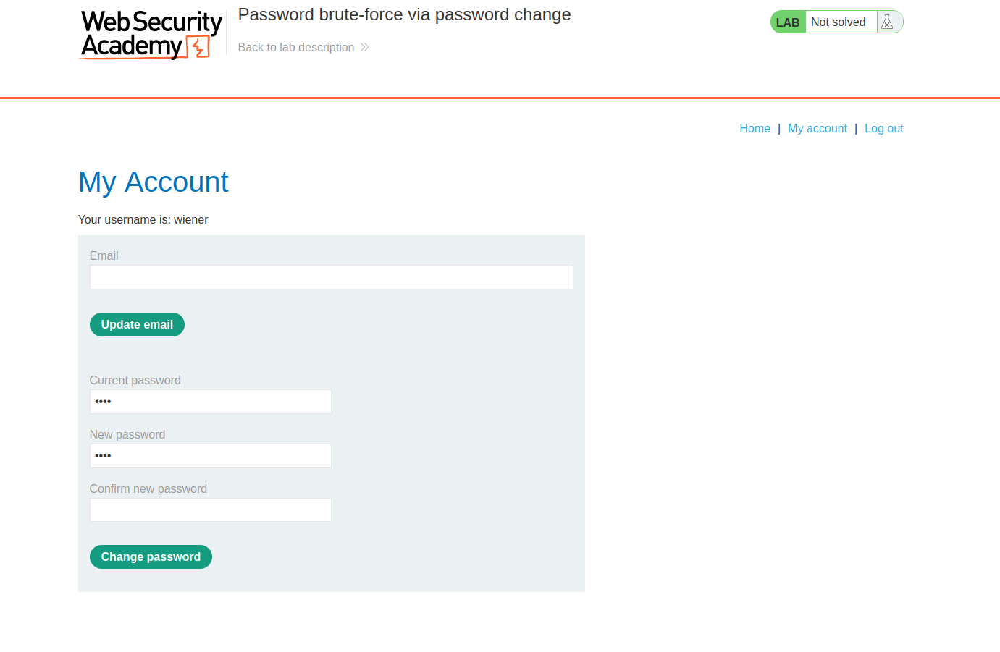
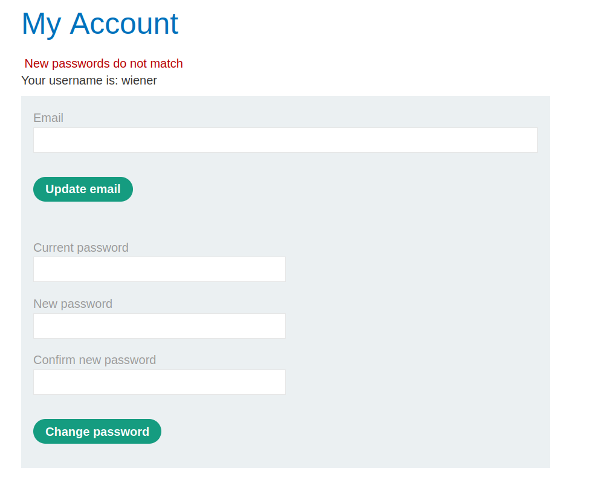
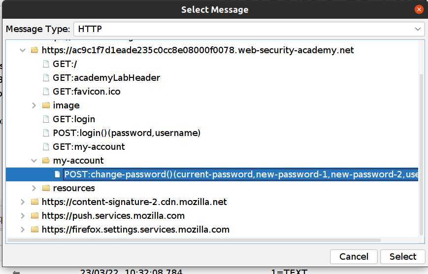
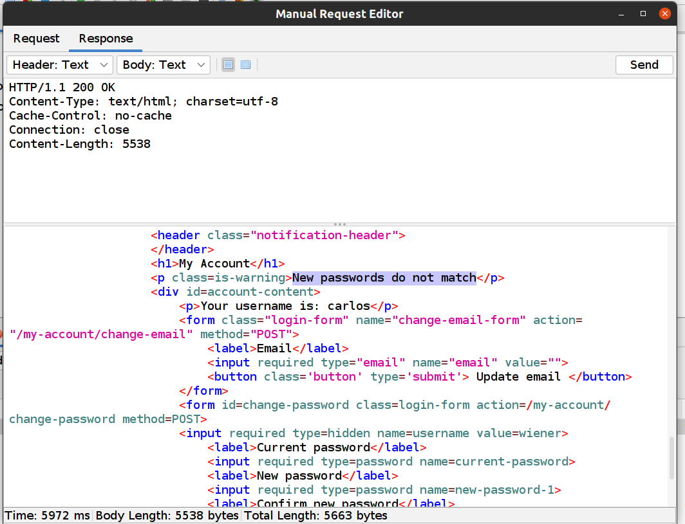
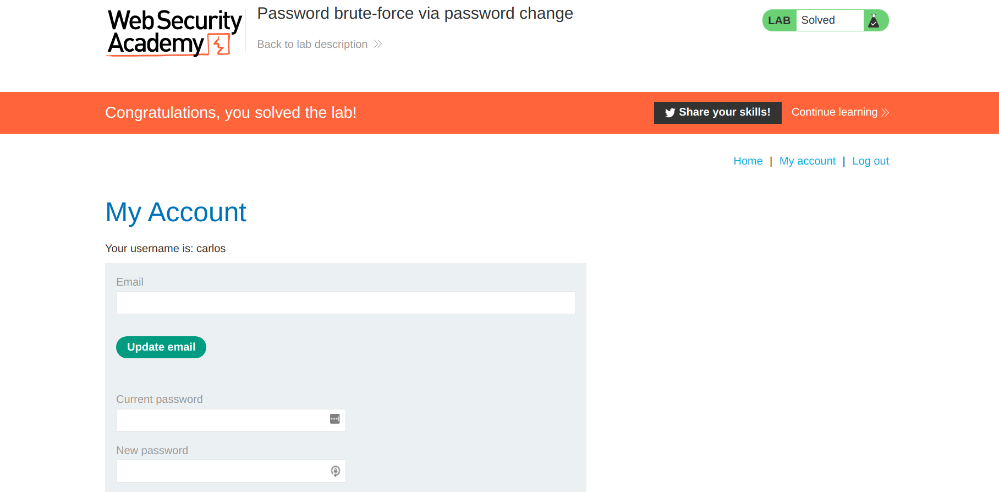

### The PortSwigger WebSecurity Academy

The [PortSwigger WebSecurity Academy](https://portswigger.net/web-security) is a great way to learn more about web security, 
but not too surprisingly it is also intended as a showcase for Burp Suite.

However you can of course use ZAP instead of Burp, and in this series of ZAP Blog posts I will show you how.

The first lab has the tag PRACTITIONER and you can find it [here](https://portswigger.net/web-security/authentication/other-mechanisms/lab-password-brute-force-via-password-change). 
I want to show you how to solve this lab using ZAP and specifically the [Fuzzer](/docs/desktop/addons/fuzzer/) tool.

### Lab instructions

This lab's password change functionality makes it vulnerable to brute-force attacks. To solve the lab, use the list of candidate passwords to brute-force Carlos' account and access his "My account" page.

* Your credentials: wiener:peter
* Victim's username: carlos
* [Candidate passwords](https://portswigger.net/web-security/authentication/auth-lab-passwords)

From the instructions it is clear we are going to use a brute-force attack - the Fuzzer is perfect for this. 

### Manual Testing

After logging into to your account with the provided credentials (wiener:peter) we can see we can update our password:

After manually testing this functionality you will find out two important things: 

1. When you try to __Change Password__ where __Current Password__ is not correct you are redirected to the login page. 
1. When you try to __Change Password__ where __Current Password__ is correct but __New Password__ and __Confirm New password__ does not match you will get the error message "__New passwords do not match__":

So that means you need to look for the error message "__New passwords do not match__". We can use this message to enumerate correct passwords for Carlos' account. 

### Attacking with ZAP

1. Copy all of the passwords from [here](https://portswigger.net/web-security/authentication/auth-lab-passwords) 
1. In the ZAP __Sites__ tree find __POST:change-password()__
1. Right click and __Attack->Fuzz …__
    
1. Highlight the current-password value:
    
1. Click on the __Fuzz Locations__ dialog "__Add...__" Button
1. In the __Payloads__ dialog click on the "__Add...__" button
1. Select __Strings__ (the default) and paste all passwords you copied above
    
1. Click on the __Add Payload__ dialog "__Add__" button
1. Click on the __Payloads__ dialog "__OK__" button
1. Click on the "__Start Fuzzer__" Button

The requests will be shown in the "Fuzzer" tab at the bottom.

When an attack is done you can notice that one message has a different __Size Resp. Body__ than the rest of the messages.

With a closer look we can see the response:

When you now try to login to your account with the new credentials the lab will be solved :smile:.

ZAP rocks! :metal: