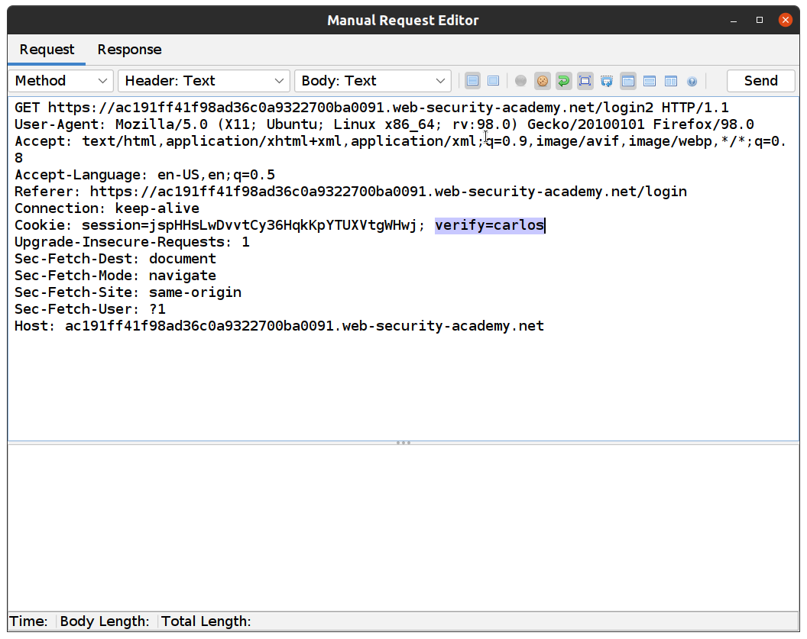
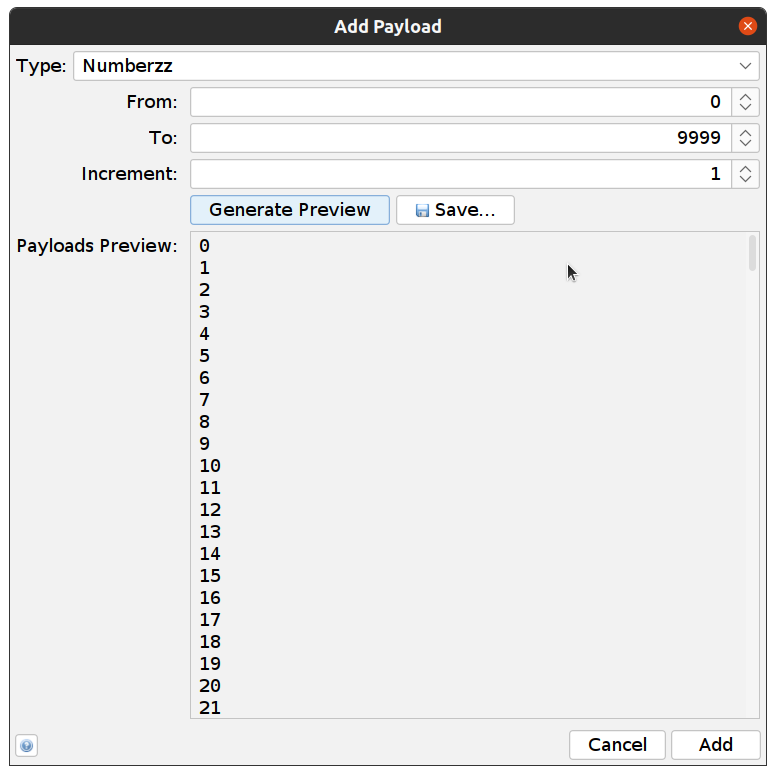
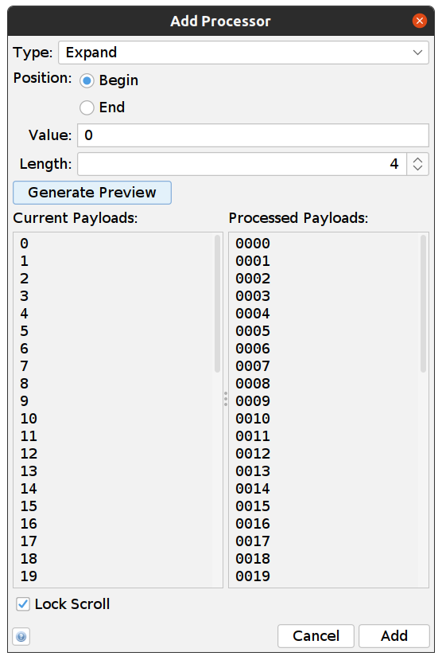
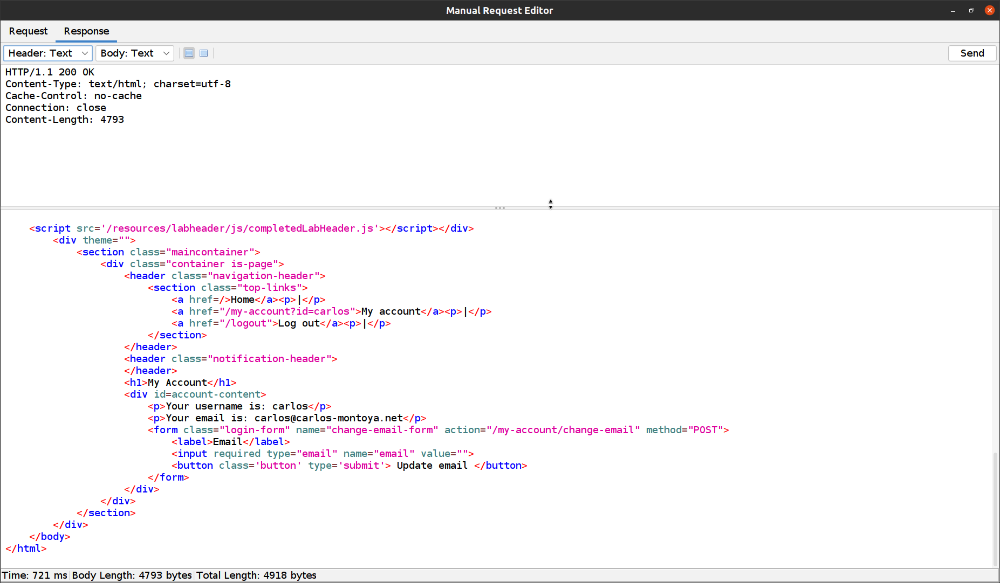

### The PortSwigger WebSecurity Academy

The [PortSwigger WebSecurity Academy](https://portswigger.net/web-security) is a great way to learn more about web security, 
but not too surprisingly it is also intended as a showcase for Burp Suite.

However you can of course use ZAP instead of Burp, and in this series of ZAP Blog posts I will show you how.

The second lab has the tag PRACTITIONER and you can find it [here](https://portswigger.net/web-security/authentication/multi-factor/lab-2fa-broken-logic). 
I want to show you how to solve this lab using ZAP and specifically the [Fuzzer](/docs/desktop/addons/fuzzer/) tool.

### Lab Instructions

This lab's two-factor authentication is vulnerable due to its flawed logic. To solve the lab, access Carlos' account page.

* Your credentials: wiener:peter
* Victim's username: carlos

You also have access to the email server to receive your 2FA verification code.

### Manual Testing

After logging into our account and using verification code, we closely explore __POST /login2__ request and we can see that the `verify` parameter is used to determine which user's account is being accessed.

If we try to login to this account multiple times, we see that the verification code is always a 4 digit number. 
 
Log out from your account. 

### Attacking with ZAP

1. First we need to resend the __GET:login2__ request to force the system to generate a verification code for Carlos. 
    __Sites -> GET:login2 -> right click -> Open/Resend with Request Editor…__
1. Change "verify" to "carlos" and click __Send__
    
1. We need to resend __POST:login2()(mfa-code)__ with a different value for "verify". 
    __Sites -> Right Click -> Open/Resend with Request Editor…__
1. Change "verify" to "carlos" and click __Send__
    
1. Now we need to send __POST:login2()(mfa-code)__ to the Fuzzer. 
    __Sites -> Right Click ->  Attack -> Fuzz…__
1. Highlight the value of mfa-code
1. Now we need to add the payloads: __Add -> Add ->__ select __Type: Numberzz__ and add these values: 
    
1. Click __Add__
1. Now we need to expand our payloads to be 4 digits: Select the first row in the __Payloads__ window and click __Processors... -> Add__ and add these values:
    
1. Click __Add__
1. Click "Start Fuzzer"

We are looking for different HTTP Code. In this example, it’s 302. 

If we open the response from this request we can see that we solved the lab and in this example, the mfa-code is 1056.

ZAP rocks! 