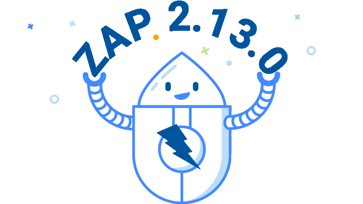

ZAP 2.13.0 has just been [released](/docs/desktop/releases/2.13.0/), and adds support for HTTP/2, improved authentication handling, and Mac Silicon.

Some of the more significant enhancements include:

### HTTP/2 Support

HTTP/2 is now supported, with no configuration changes required.

If you proxy HTTP/2 traffic through ZAP then ZAP will make the same HTTP/2 requests to the target.
Any tools that work on proxied requests will also automatically use HTTP/2.

### Improved Authentication Handling

ZAP authentication handling has been significantly overhauled, and ZAP can now auto-authenticate to many web apps by just supplying the URL of the login page along with the credentials.

For more details see:

* [Authentication Tester Dialog](/blog/2023-05-23-authentication-tester/)
* [Authentication Auto-Detection](/blog/2023-05-02-authentication-auto-detection/)

Look for more blog posts, hopefully in the near future.

### Mac Silicon Support

Mac Silicon is now supported via a new [installer](/download/#main) and in the [Docker images](/download/#docker).

### GitHub Container Registry

As explained in [this blog post](/blog/2023-06-13-ghcr-docker-images/) 
the ZAP Docker images are now also available in the GitHub Container Registry.

This may well be a better alternative for many users as, unlike Docker Hub, there is currently no rate limiting on pulls.

### Default Threads

All of the "attack" tools which use threading, including both spiders and active scanner, have been changed to use 2x the number of processors as the default number of threads. Using more threads has been shown to significantly reduce the time the scanners take to run.

### Network Rate Limiting

The Network add-on now supports a rate limiting feature which allows you to limit the request rate of HTTP/HTTPS (not web sockets) traffic to hosts or domains to prevent overloading the target or being blocked.
For more details see the [Rate Limit](/docs/desktop/addons/network/options/ratelimit/) help page.

Note that the Active Scan [Delay When Scanning](/docs/desktop/ui/dialogs/options/ascan/#delay-when-scanning-in-milliseconds)
feature has been deprecated and will be removed in a future release.

### Network Global Exclusions

The Global Exclusions functionality has been moved to the Network add-on. This will allow us to update it more easily to keep
up with browser changes.

### Scan Rule Promotions

The following __Active__ scan rules have been promoted to __Release__ status:

 - [Log4Shell](/docs/alerts/40043/)
 - [Spring Actuator Information Leak](/docs/alerts/40042/)
 - [Spring4Shell](/docs/alerts/40045/)
 - [Server Side Template Injection](/docs/alerts/90035/)
 - [Server Side Template Injection (Blind)](/docs/alerts/90036/)
 - [XPath Injection](/docs/alerts/90021/)

The following __Active__ scan rules have been promoted to __Beta__ status (and will therefore now be included in the Packaged scans):

 - [Server Side Request Forgery](/docs/alerts/40046/)
 - [Text4shell (CVE-2022-42889)](/docs/alerts/40047/)

The following __Passive__ scan rules have been promoted to __Beta__ status (and will therefore now be included in the Packaged scans):

 - [Insufficient Site Isolation Against Spectre Vulnerability](/docs/alerts/90004/)
 - [Source Code Disclosure](/docs/alerts/10099/)
  
### Dependency Updates

#### Selenium v4

The [Selenium](/docs/desktop/addons/selenium/) add-on has been updated to use the Selenium v4 library.
One benefit this brings is that the output from browsers will no longer be shown in the ZAP output - this has been
confusing to many people and has not provided any real benefit.

If you have any custom code that directly accesses Selenium classes then you may need to update it.

#### Other Updates

As usual the release includes dependency updates, see the [release notes](/docs/desktop/releases/2.13.0/) for details.

### New Add-Ons

The following add-ons are included by default in this release for the first time:

 - [Authhelper](/docs/desktop/addons/authentication-helper/) - helps identify and set up authentication handling in ZAP.

There are of course a large number of other enhancements and fixes which are detailed in the [release notes](/docs/desktop/releases/2.13.0/).  
  
Thank you to everyone who contributed to this release.
