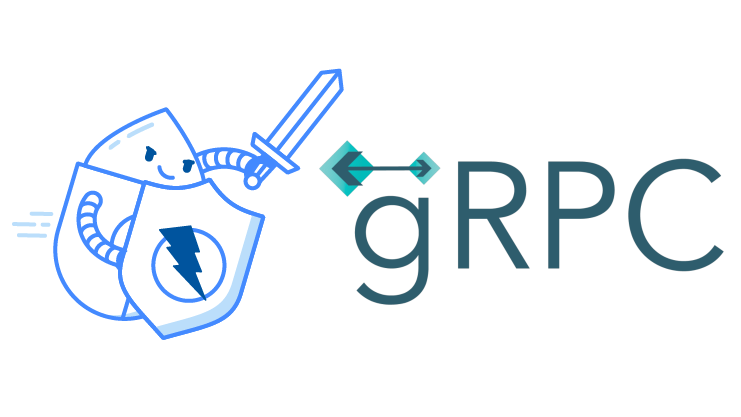
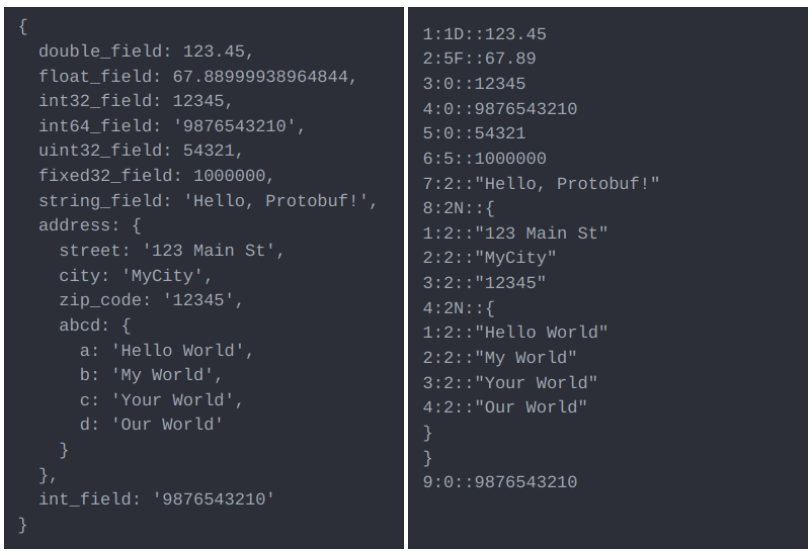
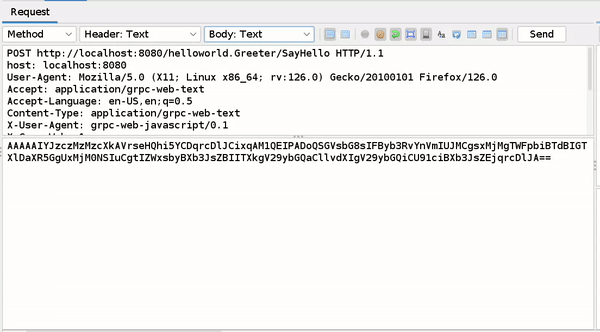

[gRPC](https://grpc.io/) APIs have become increasingly popular for building efficient and robust microservices architectures. 
However, testing these APIs effectively can be challenging, especially when dealing with Protobuf message encoding and decoding. 
In this blog post, we'll explore a [new add-on](/docs/desktop/addons/grpc-support/) designed to streamline the process of testing gRPC endpoints and handling Protobuf messages.



The add-on is still in an early stage, so the range of its functionality is limited. 
However, you can combine it with existing ZAP functionality to abuse gRPC endpoints in many different ways.

This add-on aims to simplify the testing process by providing tools for:

* **Encoding and Decoding** : Easily encode and decode Protobuf messages for testing purposes.
* **Testing gRPC Endpoints** : You can combine it with existing ZAP functionality to abuse gRPC endpoints in many different ways.

### Installation

If you are using the latest version of ZAP then you can download the gRPC add-on from the 
[ZAP Marketplace](/addons/).

### How to Display a gRPC Decoded Message

In the Message View panel, change the Body to gRPC.


### Understanding Decoded Protobuf Messages

When decoding Protobuf messages, it's essential to understand the structure of the decoded data. 
Protobuf messages consist of fields, each with a field number, wire type, and value. 
Let's delve deeper into these components:

#### Field Structure

* **Field Number** : Each field in a Protobuf message is assigned a unique field number. This number is used to identify and distinguish between different fields within the message.
* **Wire Type** : The wire type determines how the field's value is encoded and provides information about the type of data stored in the field.
* **Value** : The actual data contained within the field, encoded according to its wire type.

### Protobuf Message Structure example

Let's understand the decoded Protobuf Message Structure using an example.

This is the Base64 encoded form of the binary text received by ZAP.

```
AAAAAIYJZCZMzMzcXkAVrseHQhi5YCDqrcDlJCixqAM1QEIPADOQSGVsbG8sIFByb3RvYnVmIUJMCgs
xMjMgTWFpbiBTdBIGTX1DaXR5GgUxMjMONSIuCgtIZWxsbyBXb3JsZBIITXkgV29ybGQaCllvdXIgV2
9ybGQiCU91ciBXb3JsZEjqrcDLJA==
```

On the left side, we have the original message retrieved by the gRPC endpoint in the backend. On the right side, we have the decoded message from the above encoded text, processed by the ZAP gRPC addon.



* Each field in the message is represented as `field number:wire type::value`.
* Each key-value pair starts on a new line.
* Additional specifiers are only used for double (`1D`), float (`5F`), and nested messages (`2N`).
* For wire type `2`, the value should be enclosed in double quotes, except for nested messages (`2N`).
* For nested messages(`2N`):
  * After the field number and wire type (`fieldNumber:2N::`), an open curly brace is placed and start adding nested message fields from new line.
  * The nested message is closed with a closing curly brace on a separate new line.
* Please don't use unnecessary spaces.

### Writing and Editing Decoded Protobuf Messages

You can only edit this Decoded Message in [Requester](/docs/desktop/addons/requester/tab/) and [Manual Request Editor](/docs/desktop/addons/requester/dialogs/) windows - 
simply change the part after (`::`) which contain value or you can write new fields by following the above mentioned rules.



### The Story Behind this Add-On

The development of this add-on was proposed for Google Summer of Code 2024. 
Initially, I was preparing a proposal for this project with high hopes. 
Unfortunately, ZAP was not selected as a GSOC mentoring organisation. 

Fortunately the ZAP Core Team were still very happy to mentor me and even managed to raise sponsorship for this development from [Crash Override](https://crashoverride.com/?zap=web).

Over the past two months, I've dedicated myself to building this add-on from scratch. 
While the journey has been challenging, it's been immensely rewarding to see the project take shape. 
I've poured my energy into integrating ZAP's core functionalities for gRPC requests, ensuring that the add-on is robust and user-friendly.

Here are all the major pull requests I've made throughout the development process till now:

* PR [#5342](https://github.com/zaproxy/zap-extensions/pull/5342) - Bare bones add-on
* PR [#5433](https://github.com/zaproxy/zap-extensions/pull/5344) - Editor/View for protobuf messages
* PR [#5348](https://github.com/zaproxy/zap-extensions/pull/5348) - Decoding algorithm added
* PR [#5374](https://github.com/zaproxy/zap-extensions/pull/5374) - Encoding algorithm added
