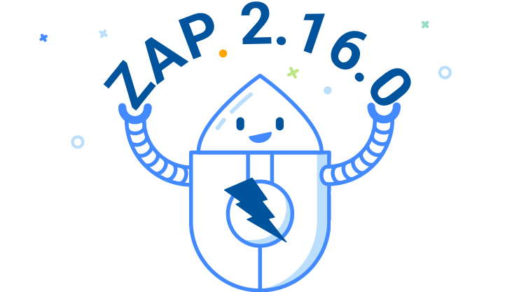

ZAP 2.16.0 has just been [released](/docs/desktop/releases/2.16.0/)!

This release was made possible thanks to [Checkmarx](https://checkmarx.com/) 
who employ 3 of the [Core Team](/docs/team/) to work fulltime on ZAP.

This is a big release and includes many very singificant changes.
Look out for new [Blog Posts](/blog/) and [Videos](/videos/) which will cover some of these new features in much more depth in the coming days and weeks.

### Update to a Minimum of Java 17

ZAP now requires a minimum of Java 17 to run. This allows us to use more modern Java features in the ZAP codebase.

As a result of this move scripts which use the Nashorn JavaScript engine may no longer work, 
this is because the engine is no longer present in Java 17.

Any scripts configured to use Nashorn will automatically be changed to use the 
[Graal.js](/docs/desktop/addons/graalvm-javascript/) JavaScript engine.
However you may still need to migrate these scripts, see the 
[Migration Guide from Nashorn to GraalJS](https://www.graalvm.org/latest/reference-manual/js/NashornMigrationGuide/).

### Client Spider

The [Client Integration](/docs/desktop/addons/client-side-integration/) add-on is now included as standard, and provides a new 
[Client Spider](/docs/desktop/addons/client-side-integration/spider/).
The Client Spider works in a similar way to the AJAX Spider but it has access to the DOM via the ZAP Browser Extension
which means that it can find content which the AJAX Spider cannot find.

While it is still at an early stage we believe it is a more effective approach than the AJAX Spider.
We will be focussing on improving the Client Spider and the current plan is for it to supersede the AJAX Spider
as the recommended way of crawling modern web apps.

### Detachable Tabs

You can now detach any of the ZAP desktop tabs so that they will appear in their own windows.
This means that you can see more than one tab in the group at the same time, and allows you to distribute those windows
across multiple monitors. 

Just right click any tab to see the 'detach' option and close the tab window to return it to the main ZAP window.

### Standard Policy Definitions

We now have a standard set of active scan policy definitions which we recommend for use in specific situations.
Using these definitions will just enable the most suitable active scan rules. This will speed up your active scans
and will reduce noise. Some of the standard active scan rules are really targetted at pentesters, and these can waste 
developers time.

For more details see the new [Scan Policies](/docs/desktop/addons/scan-policies/) add-on.

### Site Tree Export and Pruning

We now have a standard format for representing the Sites Tree in a text file: 
[Sites Tree Format](/docs/desktop/addons/import-export/sitestreeformat/) .
This format uniquely identifies nodes in the Sites tree.
While this might not sound particularly exciting, it does actually allow you to use ZAP to perform "differential" scans,
i.e. only attacking endpoints that have changed. This means that ZAP can be used to perform really fast testing in CI/CD.

### Sequence Scanning Updates

The [Sequence Scanner](/docs/desktop/addons/sequence-scanner/) add-on has received
significant attention. It now runs much more quickly and has full Automation Framework support.
As a result it has been promoted to Beta status.

### Passive Scanner Moved into an Add-On

The passive scanner has now been moved into an add-on: [Passive Scanner](/docs/desktop/addons/passive-scanner/).
We have an ongoing plan to move as much functionality out of the core as possible, as this allows us to push out fixes and
enhancements much more quickly.

### Automation Framework Enhancements

The [Automation Framework](/docs/automate/automation-framework/) has a set of new jobs:

* [activeScan-config](/docs/desktop/addons/automation-framework/job-ascanconfig/) This job configures the active scanner, for custom active scans (e.g. Sequence).
* [activeScan-policy](/docs/desktop/addons/automation-framework/job-ascanpolicy/) This job defines an active scan policy.
* [export](/docs/desktop/addons/import-export/automation/) This job allows you to export messages in HAR format or as URLs as well as exporting the Sites Tree.
* [prune](/docs/desktop/addons/import-export/automation/) This job allows you to remove nodes from the Sites Tree using data from a file in the Sites Tree format.
* [spiderClient](/docs/desktop/addons/client-side-integration/automation/) This job allows you to run the client spider.
* [exitStatus](/docs/desktop/addons/automation-framework/job-exitstatus/) This job sets ZAP's exit code based on scan results.
* [sequence-import](/docs/desktop/addons/sequence-scanner/automation/) This job allows you to create a sequence from an HAR file.
* [sequence-activeScan](/docs/desktop/addons/sequence-scanner/automation/) This job allows you to active scan sequences.

### Checkmarx Rebranding

This release is the first full release with the "ZAP by Checkmarx" branding.

### Docker Hub Organisation Deprecation

We will not use the [softwaresecurityproject](https://hub.docker.com/u/softwaresecurityproject) org for 2.16.0 or following releases.

If you still use this org then please switch to [zaproxy](https://hub.docker.com/u/zaproxy).
 
### Release Notes

See the [release notes](/docs/desktop/releases/2.16.0/) for dependency updates, other enhancements, and fixes.  
  
Thank you to everyone who contributed to this release.
