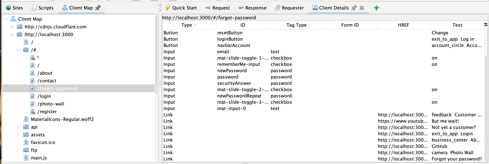

In ZAP 2.16.0 we introduced a new [Client Spider](/docs/desktop/addons/client-side-integration/spider/) :spider:. 
This blog post and video explain why we did that, how it works, and where it’s going.

### ZAP Chat Video



### Yet Another Spider?
ZAP already has 2 spiders:
* The traditional spider that works well for traditional apps
* The AJAX spider which works well for modern apps

The traditional spider is an old school web crawler - it makes http(s) requests to the target, analyzes the responses, and then follows up any links and submits any forms it finds.
It is very fast, but it doesn’t work well with modern web apps.
Why? Because modern web apps make very heavy use of JavaScript and typically do not have a load of links visible in the responses.

In order to crawl modern web apps you really need to use a browser, nothing else will be able to reliably render or interact with them.
That's why the AJAX spider works by launching browsers and then explores them by clicking on links, filling in forms, etc.
It is much more effective than the traditional spider for modern web apps, but we have found that it does not perform as well as we would like.

The AJAX spider is based on a third party OSS project: [Crawljax](https://github.com/crawljax/crawljax). 
It is a big project and is maintained intermittently. While we have contributed enhancements to this project we no longer believe that it is the best option for us going forwards. Instead we are focussing on the new Client Spider which we believe will be more effective.

### How Does It Work?
At a high level the Client Spider works in a very similar way to the AJAX Spider - it launches browsers, clicks on links, fills in forms, etc.
It is part of the [Client Side Integration](/docs/desktop/addons/client-side-integration/) add-on, 
which includes the [ZAP Browser Extension](https://github.com/zaproxy/browser-extension/) that is injected into the browsers that ZAP launches.
The Browser Extension streams selected events from the browser to ZAP, and this allows us to build up the Client Map, which is ZAP’s representation of the app’s structure in the browser.
Details of the selected node are shown in the Client Details tab.

Unlike the AJAX Spider, the Client Spider uses the Client Map. This means it has access to links and controls that are in the DOM.

As new parts of the target are discovered they are added to the Client Spider task list, and unlike the AJAX Spider we can easily show them in the Desktop UI, via the “Tasks” subtab:

We also show the nodes as they are added to the Client Map:

As well as providing full access to all of the messages sent by the browsers:

### How Can You Use It?
The Client Spider can be invoked in the same way as the AJAX Spider:
* Context specific “Attack” menu
* "Tools / Client Spider" menu item
* Automation Framework spiderClient job

### How Can You Compare It?
Not surprisingly we have compared it against a range of modern web apps, and so far it has shown that it can typically find more endpoints than the AJAX Spider and do so more quickly (unless it finds a _lot_ more endpoints of course!).

We run it regularly against [Google Crawlmaze](https://github.com/google/security-crawl-maze) and publish the results: 
[ZAP vs Security Crawl Maze](/docs/scans/crawlmaze/).

If you want to compare it against the AJAX Spider for your apps then the easiest way to do this is to run both spiders against your apps with the same authentication but in separate ZAP sessions.

Once they have run then [Save the Sites Tree](/docs/desktop/addons/import-export/#save-sites-tree) (if using the ZAP desktop) 
or [export](/docs/desktop/addons/import-export/automation/#job-export) it (if using the Automation Framework).

The [Sites Tree Format](/docs/desktop/addons/import-export/sitestreeformat/) is a sorted YAML representation of the Sites Tree so you can use your favorite diff command to compare them.

You can also compare the Client Map in a similar way, although this is currently only possible via the 
Desktop [Export Client Map option](/docs/desktop/addons/client-side-integration/#export-client-map).

### What’s Next
Is this Client Spider finished?

No, we still have lots to do. 

For a start the spider only clicks on links and buttons, it does not currently click on divs and other HTML elements that can be used for navigation.

We need to track the interactions needed to expose more site content and replay those steps when exploring apps.

We also need to actually use the Client Map when attacking sites, especially for client vulnerabilities like DOM XSS.

### We Need Your Feedback
While we have tested the Client Spider against various deliberately vulnerable modern web apps, the key measure of success is how well it runs against real world apps.

For this we need your feedback on this [ZAP User Group thread](https://groups.google.com/g/zaproxy-users/c/xcL656sglG8/m/6py_R6mQDwAJ).

Please run the Client Spider against your apps and let us know how well it works, either on its own or in comparison to the AJAX Spider.

If there are parts of your app that it does not find then have a look to see where and how that content is linked from in your app. The more details you can share with us (for example DOM HTML fragments) the better.
